<div align="center">

# 🍳 Wheel of Creation: Agriculture Update II

### _Diet, Nutrition & Cooking — Minecraft Bedrock_

[](https://minecraft.net)
[](LICENSE)
[](https://www.typescriptlang.org/)

🌐 **[🇪🇸 Leer en Español](./AGRICULTURE_UPDATE_II_SPANISH.md)** | **[🇧🇷 Ler em Português](./AGRICULTURE_UPDATE_II_PORTUGUESE.md)**

---

**The second chapter of the Agriculture Update arrives with 4 new crops, 29 food recipes, a complete 7-nutrient diet system that affects your combat stats, and vanilla food rebalancing that makes cooking genuinely matter.**

> 🎮 **Requires [Agriculture Update I](./AGRICULTURE_UPDATE_I_ENGLISH.md)** — This update builds upon the farming systems introduced in the first release. Make sure you're familiar with the base mechanics before diving in.


</div>

---

<div align="center">

### ✅ What's New in Agriculture Update II

</div>

> This update focuses on **what happens after the harvest**. While Update I reimagined how crops grow, Update II reimagines **why you grow them**. Food is no longer just hunger points — it's a strategic resource that directly impacts your strength, resilience, and maximum health.

---

## 📋 Table of Contents

- [New Crops](#-new-crops)
    - [Tomatoes](#-tomatoes)
    - [Cabbages](#-cabbages)
    - [Onions](#-onions)
    - [Rice (Water Crop)](#-rice--water-crop)
- [Cooking & Recipes](#-cooking--recipes)
    - [Ingredients](#-base-ingredients)
    - [Sandwiches](#-sandwiches)
    - [Bowl Meals](#-bowl-meals--stews)
    - [Other Recipes](#-other-recipes)
- [Diet & Nutrition System](#-diet--nutrition-system)
    - [The 7 Nutrient Groups](#-the-7-nutrient-groups)
    - [How Digestion Works](#-how-digestion-works)
    - [Buffs & Debuffs](#-buffs--debuffs)
    - [Diet Book](#-diet-book)
- [Vanilla Food Rebalancing](#-vanilla-food-rebalancing)
- [Updated Farmer Trades](#-updated-farmer-trades)
- [Tips & Strategies](#-tips--strategies)

---

## 🌱 New Crops

Agriculture Update II introduces **4 new crops**, each with unique growing conditions and mechanics. One of them — Rice — introduces an entirely new crop category: **Water Crops**.

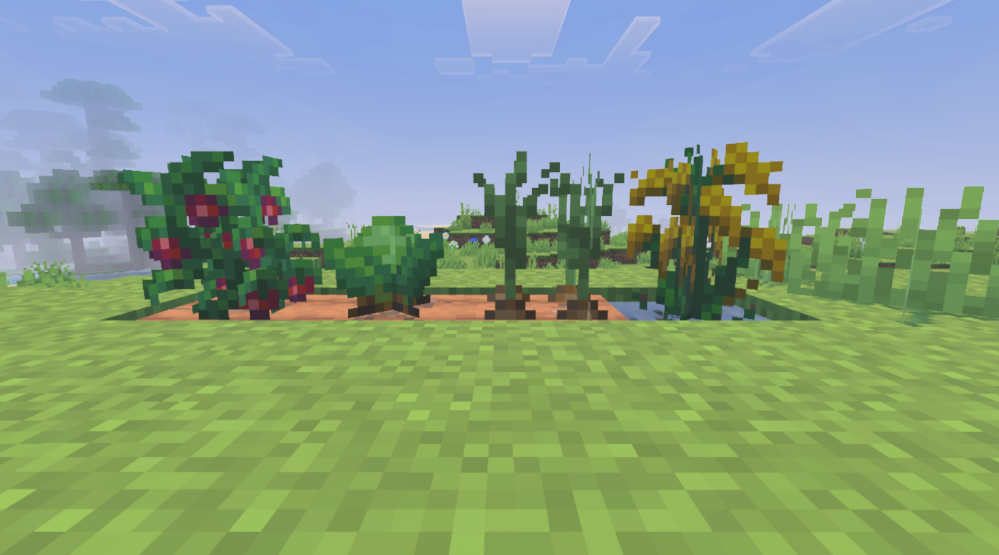

---

### 🍅 Tomatoes

The most productive crop in the game, but also the most demanding. Tomatoes have the **highest weed susceptibility** (18%) of any crop, making Select seeds and fertilizer almost mandatory.

| Property              | Value                              |
| --------------------- | ---------------------------------- |
| **ID**                | `woc:tomatoes`                     |
| **Growth Stages**     | 8 (0–7)                            |
| **Growth Time**       | 56 in-game days (~18.7 real hours) |
| **Hydration Range**   | 5–7 (very narrow)                  |
| **Temperature Range** | 15–30°C                            |
| **Base Drops**        | 4 Tomatoes + 2 Seeds               |
| **Weed Probability**  | 18% ⚠️                             |
| **Preferred Biomes**  | Plains, Savanna, Jungle, Forest    |

> 💡 **Tip**: Tomatoes' narrow hydration range (5–7) means you need to be precise with water placement. Too wet and they rot, too dry and they wither. Use the Crop Inspector constantly.

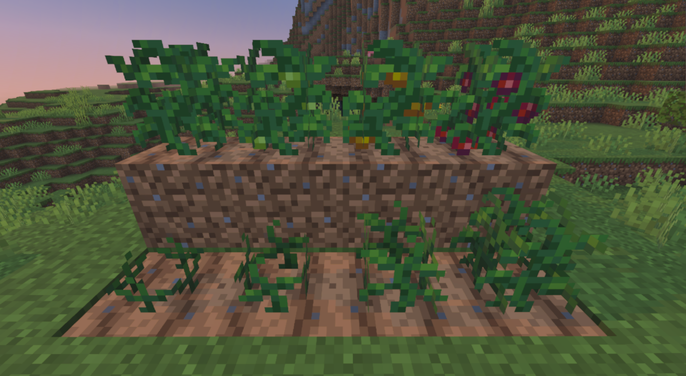

---

### 🥬 Cabbages

A cold-climate powerhouse. Cabbages thrive in temperatures where most crops would die, making them the perfect complement to Beetroots in frozen biomes. They're also a key ingredient for many cooking recipes.

| Property              | Value                             |
| --------------------- | --------------------------------- |
| **ID**                | `woc:cabbages`                    |
| **Growth Stages**     | 8 (0–7)                           |
| **Growth Time**       | 72 in-game days (~24 real hours)  |
| **Hydration Range**   | 4–8                               |
| **Temperature Range** | -10 to 15°C                       |
| **Base Drops**        | 1 Cabbage + 2 Seeds               |
| **Weed Probability**  | 2%                                |
| **Preferred Biomes**  | Taiga, Grove, Meadow, Cold biomes |

> 💡 **Tip**: Cabbages have the longest growth time of any base crop (72 days). Plan ahead and use fertilizer to speed things up. Their low weed risk makes them very low-maintenance once planted.

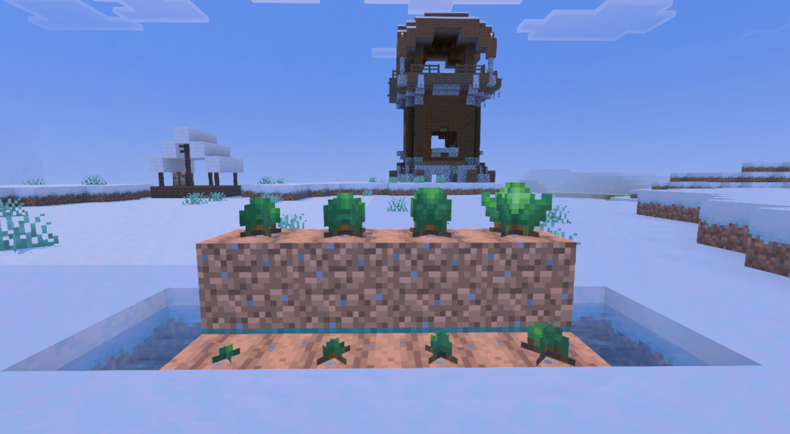

---

### 🧅 Onions

A versatile mid-climate crop that works like carrots — the harvested onion itself is replanted. Onions appear in many cooking recipes, making them a staple ingredient you'll always want in stock.

| Property              | Value                              |
| --------------------- | ---------------------------------- |
| **ID**                | `woc:onions`                       |
| **Growth Stages**     | 4 (0–3)                            |
| **Growth Time**       | 64 in-game days (~21.3 real hours) |
| **Hydration Range**   | 3–7                                |
| **Temperature Range** | 5–25°C                             |
| **Base Drops**        | 3 Onions                           |
| **Weed Probability**  | 6%                                 |
| **Preferred Biomes**  | Plains, Meadow, Forest             |

> 💡 **Tip**: Like carrots and potatoes, onions use the crop itself as the seed. Replant at least one from each harvest to maintain your supply.

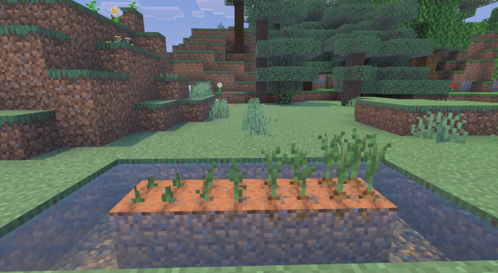

---

### 🍚 Rice — Water Crop

Rice introduces the first **Water Crop** in the addon — a completely new crop category. Unlike all other crops, rice does **NOT** grow on farmland. It must be planted on **dirt, mud, or grass** blocks that are **submerged in water**.

| Property              | Value                              |
| --------------------- | ---------------------------------- |
| **ID**                | `woc:rices`                        |
| **Growth Stages**     | 5 base + 4 panicle                 |
| **Growth Time**       | 64 in-game days (~21.3 real hours) |
| **Temperature Range** | 18–34°C                            |
| **Base Drops**        | 1 Rice Panicle + 1 Seed            |
| **Valid Soil**        | Dirt, Mud, Grass Block             |
| **Preferred Biomes**  | Swamp, Jungle, River, Lush Caves   |

#### How Rice Grows

Rice has a unique **two-block growth system**:

```
     Stage 1: Base             Stage 2: Panicle
    ┌──────────┐              ┌──────────┐
    │          │              │ 🌾 Panicle│  ← Harvestable part
    │~~Water~~~│              │~~Water~~~~│
    │ 🌱 Base  │              │ 🌿 Base   │  ← Submerged in water
    │  [Soil]  │              │  [Soil]   │
    └──────────┘              └──────────┘
    70% of growth time         30% of growth time
```

1. **Plant** rice panicle on dirt/mud/grass that's submerged in water
2. The **base** grows through 5 stages underwater (70% of growth time)
3. Once the base matures, a **panicle** sprouts above water level
4. The panicle grows through 4 stages (30% of growth time)
5. **Harvest** the mature panicle for Rice Panicles and seeds
6. Breaking either block destroys both

#### Building a Rice Paddy

> 🌊 The ideal rice paddy is a shallow pool (1 block deep) of water on dirt or mud, in a warm biome (Swamp, Jungle, River). You can apply fertilizer directly to the base block to increase yields.


#### Rice Processing

Raw Rice Panicles must be **threshed** before cooking:

| Input                    | Station     | Output  |
| ------------------------ | ----------- | ------- |
| 1× Rice Panicle (Wild)   | Stonecutter | 1× Rice |
| 1× Rice Panicle (Select) | Stonecutter | 2× Rice |

---

## 🍳 Cooking & Recipes

Agriculture Update II introduces **29 new food items** across multiple categories. Cooking isn't just for fun — the diet system means every meal choice impacts your combat performance.


---

### 🥩 Base Ingredients

These are intermediate items used in more complex recipes.

<details>
<summary><b>🥩 Bacon (Click to expand)</b></summary>

| Property    | Value                                                       |
| ----------- | ----------------------------------------------------------- |
| **Recipe**  | 1× Raw Porkchop → 2× Bacon                                  |
| **Station** | Stonecutter                                                 |
| **Use**     | Ingredient for sandwiches, cook in furnace for Cooked Bacon |

</details>

<details>
<summary><b>🍳 Fried Egg (Click to expand)</b></summary>

| Property    | Value                                      |
| ----------- | ------------------------------------------ |
| **Recipe**  | 1× Egg → 1× Fried Egg                      |
| **Station** | Furnace / Smoker                           |
| **Use**     | Ingredient for sandwiches and Bacon & Eggs |

</details>

<details>
<summary><b>🥬 Cabbage Leaf (Click to expand)</b></summary>

| Property    | Value                                                   |
| ----------- | ------------------------------------------------------- |
| **Recipe**  | 1× Cabbage → 2× Cabbage Leaf                            |
| **Station** | Crafting Table                                          |
| **Use**     | Key ingredient for rolls, dumplings, sandwiches, salads |

</details>

<details>
<summary><b>🫓 Wheat Dough (Click to expand)</b></summary>

| Property    | Value                                                          |
| ----------- | -------------------------------------------------------------- |
| **Recipe**  | 8× Wheat + 1× Water Bucket → 3× Wheat Dough (+ returns Bucket) |
| **Station** | Crafting Table (shaped)                                        |
| **Use**     | Ingredient for Bread and Dumplings                             |

</details>

<details>
<summary><b>🥓 Cooked Bacon (Click to expand)</b></summary>

| Property    | Value                                          |
| ----------- | ---------------------------------------------- |
| **Recipe**  | 1× Bacon → 1× Cooked Bacon                     |
| **Station** | Furnace / Smoker                               |
| **Use**     | Ingredient for Bacon Sandwich and Bacon & Eggs |

</details>

<details>
<summary><b>🍼 Milk Bottle (Click to expand)</b></summary>

| Property    | Value                                                                |
| ----------- | -------------------------------------------------------------------- |
| **Recipe**  | 8× Glass Bottle + 1× Milk Bucket → 8× Milk Bottle (+ returns Bucket) |
| **Station** | Crafting Table (shaped)                                              |
| **Use**     | Dairy nutrient source, stackable to 16                               |

</details>

<details>
<summary><b>🍞 Bread (New Recipe) (Click to expand)</b></summary>

| Property    | Value                                                         |
| ----------- | ------------------------------------------------------------- |
| **Recipe**  | 1× Wheat Dough → 1× Bread                                     |
| **Station** | Furnace / Smoker                                              |
| **Note**    | Replaces vanilla bread recipe. Now requires Wheat Dough first |

</details>

---

### 🥪 Sandwiches

Portable, stackable meals perfect for adventures. All sandwiches stack to 64.

<details>
<summary><b>🥪 All Sandwich Recipes (Click to expand)</b></summary>

| Sandwich                | Ingredients                                    | Output              |
| ----------------------- | ---------------------------------------------- | ------------------- |
| 🥚 **Egg Sandwich**     | Fried Egg + Bread                              | 2× Egg Sandwich     |
| 🐔 **Chicken Sandwich** | Cooked Chicken + Bread + Cabbage Leaf + Tomato | 2× Chicken Sandwich |
| 🥓 **Bacon Sandwich**   | Cooked Bacon + Bread + Cabbage Leaf + Tomato   | 2× Bacon Sandwich   |

All crafted on the **Crafting Table** (shapeless).

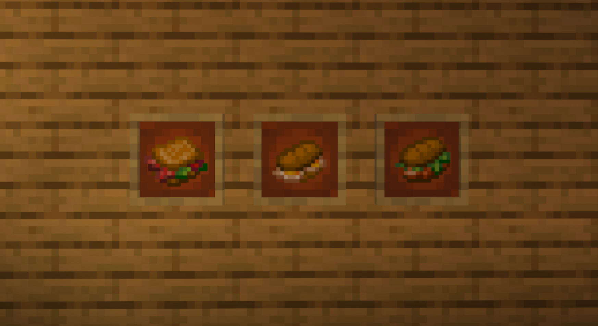
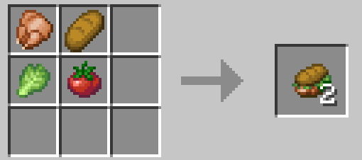
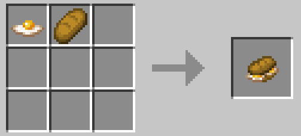
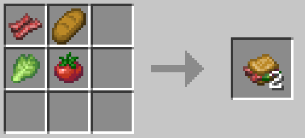

</details>

---

### 🥣 Bowl Meals & Stews

Hearty meals served in bowls. Stack to 16 and return the bowl when eaten.

<details>
<summary><b>🥩 Meat-Based Stews (Click to expand)</b></summary>

| Meal                    | Ingredients                                | Station        |
| ----------------------- | ------------------------------------------ | -------------- |
| 🥩 **Beef Stew**        | Bowl + Cooked Beef + Baked Potato + Carrot | Crafting Table |
| 🍗 **Chicken Soup**     | Bowl + Cooked Chicken + Carrot + Onion     | Crafting Table |
| 🥓 **Bacon & Eggs**     | Bowl + Cooked Bacon + Fried Egg            | Crafting Table |
| 🦴 **Bone Broth**       | Bowl + Bone + Onion                        | Crafting Table |
| 🥩 **Steak & Potatoes** | Bowl + Cooked Beef + Baked Potato          | Crafting Table |

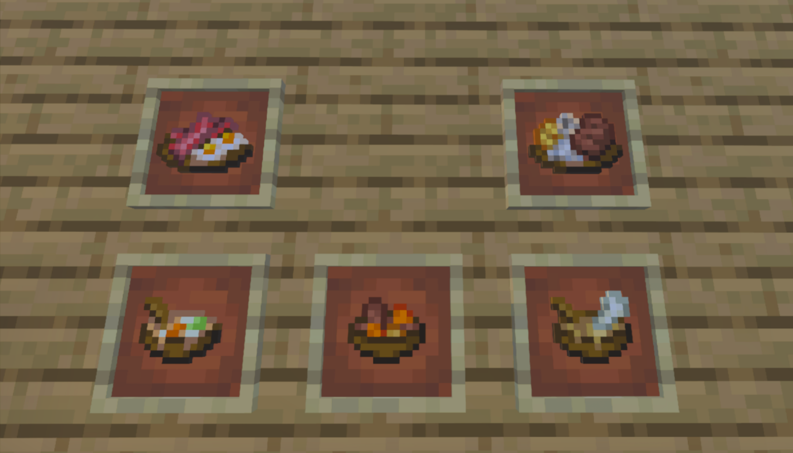
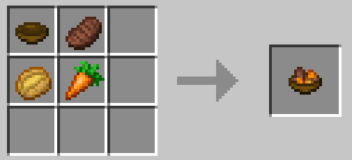
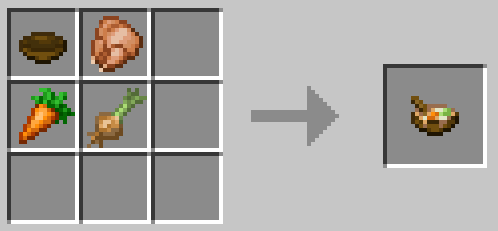
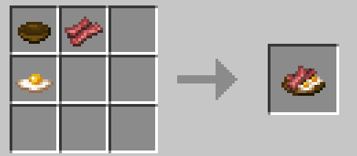
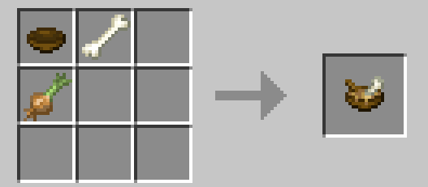
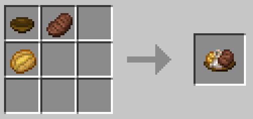

</details>

<details>
<summary><b>🐟 Fish-Based Stews (Click to expand)</b></summary>

| Meal                  | Ingredients                                 | Station        |
| --------------------- | ------------------------------------------- | -------------- |
| 🐟 **Fish Stew**      | Bowl + Cooked Salmon + Baked Potato + Onion | Crafting Table |
| 🐟 **Baked Cod Stew** | Bowl + Cooked Cod + Baked Potato + Tomato   | Crafting Table |

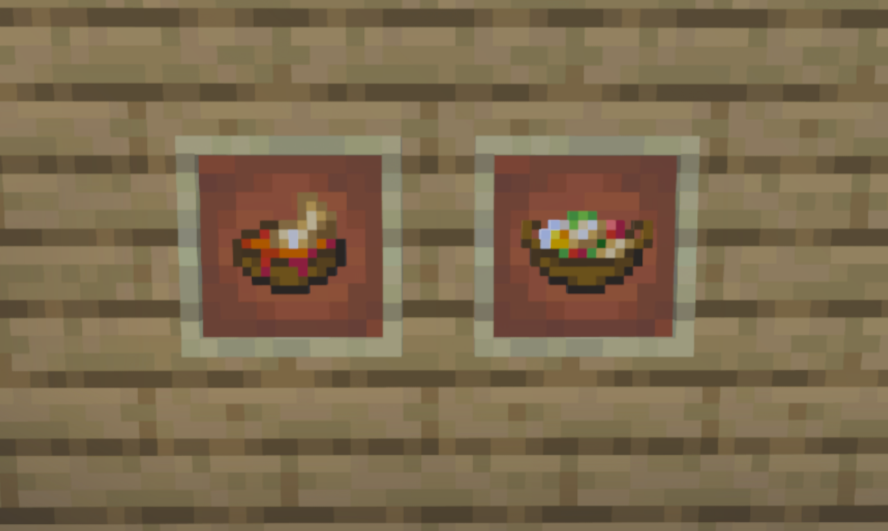
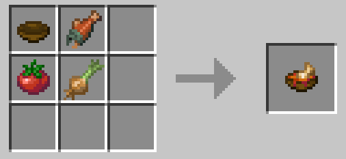
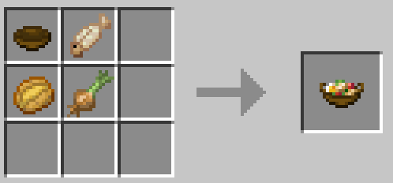

</details>

<details>
<summary><b>🥗 Vegetable & Rice Bowls (Click to expand)</b></summary>

| Meal                  | Ingredients                                 | Station        |
| --------------------- | ------------------------------------------- | -------------- |
| 🍚 **Cooked Rice**    | Bowl + 2× Rice                              | Crafting Table |
| 🍳 **Fried Rice**     | Bowl + Rice + Egg + Onion                   | Crafting Table |
| 🍄 **Mushroom Rice**  | Bowl + Rice + Brown Mushroom + Red Mushroom | Crafting Table |
| 🥗 **Mixed Salad**    | Bowl + Cabbage Leaf + Carrot + Tomato       | Crafting Table |
| 🍅 **Tomato Sauce**   | Bowl + 2× Tomato + Onion                    | Crafting Table |
| 🎃 **Pumpkin Soup**   | Bowl + Pumpkin + Onion                      | Crafting Table |
| 🥬 **Vegetable Soup** | Bowl + Cabbage Leaf + Carrot + Onion        | Crafting Table |

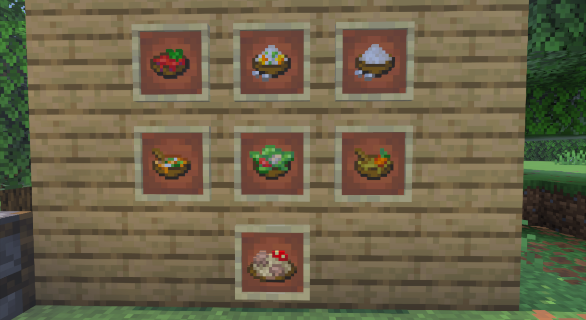
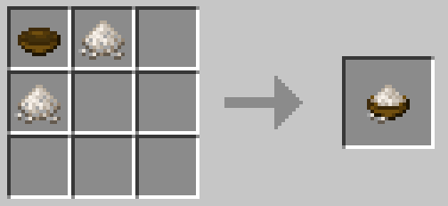
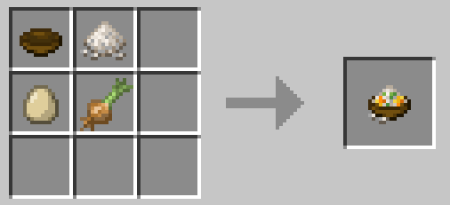
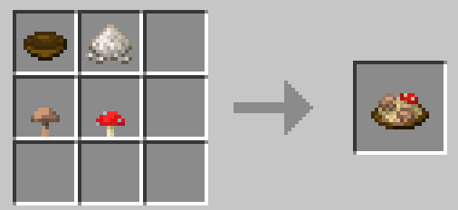
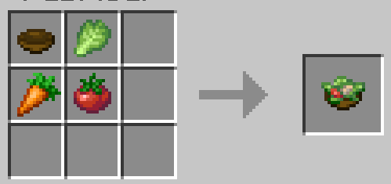

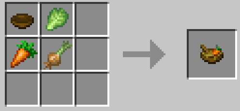

</details>

---

### 🥟 Other Recipes

<details>
<summary><b>🥟 Dumplings — 5 Variants (Click to expand)</b></summary>

All dumplings use the same base: **Cabbage Leaf + Wheat Dough + Cooked Meat** → 2× Dumplings

| Variant           | Meat Used       |
| ----------------- | --------------- |
| Beef Dumplings    | Cooked Beef     |
| Chicken Dumplings | Cooked Chicken  |
| Mutton Dumplings  | Cooked Mutton   |
| Pork Dumplings    | Cooked Porkchop |
| Rabbit Dumplings  | Cooked Rabbit   |

Crafted on the **Crafting Table** (shapeless).

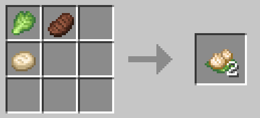
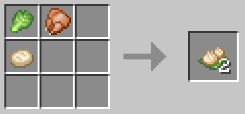
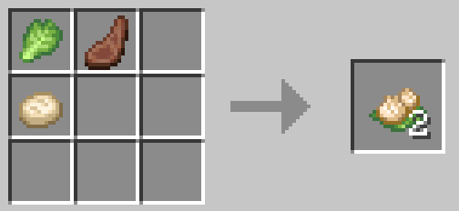
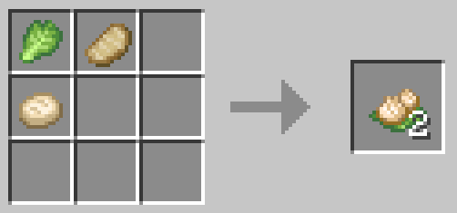
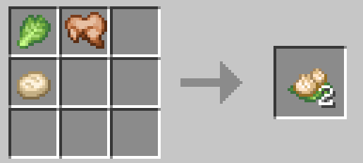

</details>

<details>
<summary><b>🥬 Cabbage Rolls — 5 Variants (Click to expand)</b></summary>

All use: **Cabbage Leaf + Vegetable** → 2× Cabbage Rolls

| Variant        | Filling  |
| -------------- | -------- |
| Beetroot Rolls | Beetroot |
| Carrot Rolls   | Carrot   |
| Onion Rolls    | Onion    |
| Potato Rolls   | Potato   |
| Tomato Rolls   | Tomato   |

Crafted on the **Crafting Table** (shapeless).

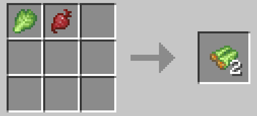
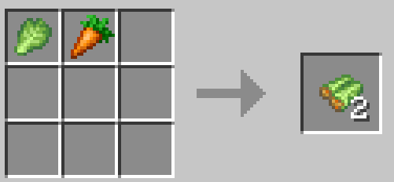
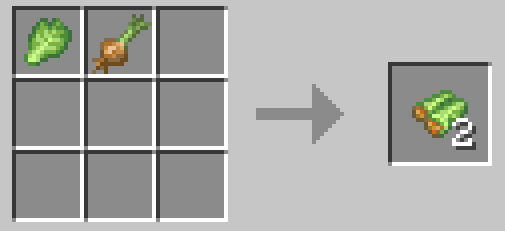
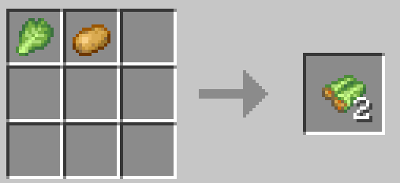
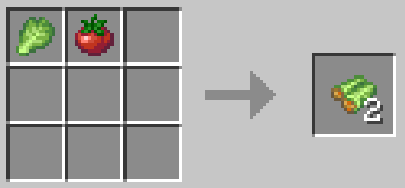

</details>

---

## 🥗 Diet & Nutrition System

The centerpiece of Agriculture Update II. Every food you eat contributes to **7 nutrient groups**, and your nutrient balance directly affects your **maximum health, attack damage, and damage resistance**.

This system rewards **dietary variety** and punishes monotonous eating habits.

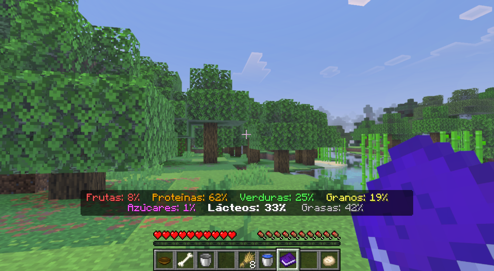

---

### 📊 The 7 Nutrient Groups

| #   | Nutrient          | Icon | Burn Rate        | Description                         |
| --- | ----------------- | ---- | ---------------- | ----------------------------------- |
| 0   | 🍎 **Fruits**     | 🔴   | Fast (1.4×)      | Apples, berries, melon slices       |
| 1   | 🥩 **Proteins**   | 🟠   | Slow (0.9×)      | Meat, fish, eggs                    |
| 2   | 🥬 **Vegetables** | 🟢   | Normal (1.1×)    | Carrots, cabbages, onions, tomatoes |
| 3   | 🌾 **Grains**     | 🟡   | Normal (1.0×)    | Bread, rice, wheat-based foods      |
| 4   | 🍬 **Sugars**     | 🟣   | Very Fast (1.6×) | Cookies, cake, honey, golden foods  |
| 5   | 🥛 **Dairy**      | ⬜   | Slow (0.7×)      | Milk bottles                        |
| 6   | 🧈 **Fats**       | ⬛   | Very Slow (0.6×) | Bacon, cooked meats, oily foods     |

> Each nutrient ranges from **0% to 100%**. Higher is better — but keeping them all balanced is the real challenge.

---

### ⚙️ How Digestion Works

Your body doesn't process all nutrients equally. The system simulates realistic digestion:

#### Eating & Absorption

- When you eat, the food's nutrients are **added to your profile**
- A **history of 20 recent foods** is tracked
- **Repetition penalty**: eating the same food repeatedly reduces its effectiveness by 10% per repetition in your last 10 meals (minimum 20% effectiveness)
- This means **eating varied foods is significantly more effective** than spam-eating steak

#### Nutrient Burning (Digestion)

- Every **~20 seconds**, your body randomly burns 1–3 nutrients
- **Sugars burn fastest** (1.6×), **Fats burn slowest** (0.6×)
- Physical activity accelerates burning: sprinting (×2.5), swimming (×2.0), climbing (×1.8)
- Extreme temperatures increase nutrient consumption (your body works harder)

#### Synergies

- If Sugars + Grains are both high (>40%), Protein and Fat burn 50% slower (your body has quick energy available)
- Intense activity (sprinting) accelerates Fruit and Sugar burning specifically

---

### 💪 Buffs & Debuffs

Your nutrient balance produces three combat-relevant stats. These are recalculated every **~60 seconds**.

#### ❤️ Maximum Health (10–40 HP)

| Nutrient Weight | Contribution |
| --------------- | ------------ |
| Sugars          | 30%          |
| Fruits          | 25%          |
| Vegetables      | 20%          |
| Grains          | 15%          |
| Dairy           | 5%           |
| Fats            | 5%           |

| Diet Quality | Max HP    | Hearts    |
| ------------ | --------- | --------- |
| Starving     | 10 HP     | 5 ❤️      |
| Poor         | 14–18 HP  | 7–9 ❤️    |
| **Normal**   | **20 HP** | **10 ❤️** |
| Good         | 24–28 HP  | 12–14 ❤️  |
| Excellent    | 32–40 HP  | 16–20 ❤️  |

#### ⚔️ Attack Damage (×0.6 – ×1.6)

| Nutrient Weight | Contribution |
| --------------- | ------------ |
| Proteins        | 40%          |
| Grains          | 25%          |
| Fruits          | 15%          |
| Sugars          | 10%          |
| Vegetables      | 10%          |

A well-fed warrior deals up to **60% more damage**. A malnourished one deals **40% less**.

#### 🛡️ Damage Resistance (×0.6 – ×1.4)

| Nutrient Weight | Contribution |
| --------------- | ------------ |
| Fats            | 35%          |
| Dairy           | 25%          |
| Proteins        | 20%          |
| Grains          | 10%          |
| Vegetables      | 10%          |

With high Fats and Dairy, incoming damage is reduced by up to **40%**. Neglecting them increases damage taken by **40%**.

> ⚠️ **Balance Factor**: Maxing only one nutrient while ignoring others suppresses your buffs. The system uses a **smoothstep curve** that rewards balanced diets over min-maxing a single nutrient.

> ℹ️ **Note**: Debuffs (stats below normal) can be disabled in the addon configuration. Buffs are always active.

---

### 📖 Diet Book

The **Diet Book** is your window into your nutritional status. Craft it and hold it to see your 7 nutrient levels displayed on the action bar.


---

## ⚖️ Vanilla Food Rebalancing

Agriculture Update II **rebalances all vanilla foods** to make the cooking system meaningful. Vanilla foods now provide significantly less nutrition and saturation.

<details>
<summary><b>📊 Complete Vanilla Food Changes (Click to expand)</b></summary>

| Food            | Original Nutrition | New Nutrition | Change |
| --------------- | ------------------ | ------------- | ------ |
| Cooked Beef     | 8                  | 3             | -62%   |
| Cooked Porkchop | 8                  | 3             | -62%   |
| Cooked Chicken  | 6                  | 3             | -50%   |
| Cooked Mutton   | 6                  | 3             | -50%   |
| Bread           | 5                  | 3             | -40%   |
| Baked Potato    | 5                  | 2             | -60%   |
| Cooked Salmon   | 6                  | 3             | -50%   |
| Cooked Cod      | 5                  | 3             | -40%   |
| Apple           | 4                  | 2             | -50%   |
| Carrot          | 3                  | 1             | -67%   |
| Potato          | 1                  | 1             | —      |
| Beetroot        | 1                  | 1             | —      |

> 💡 **Why?** Simple foods like a raw steak shouldn't be as effective as a carefully prepared Beef Stew with potatoes and carrots. This rebalancing creates a progression curve where cooking becomes a genuine survival advantage.

</details>

---

## 🏪 Updated Farmer Trades

Farmer Villagers now offer trades for all new crops and seeds at **Tier 4** (150 XP required).

<details>
<summary><b>🏪 New Farmer Trades — Tier 4 (Click to expand)</b></summary>

#### Buying (Farmer buys from you)

| Crop    | Amount | Price     |
| ------- | ------ | --------- |
| Tomato  | 20     | 1 Emerald |
| Cabbage | 12     | 1 Emerald |
| Onion   | 22     | 1 Emerald |
| Rice    | 26     | 1 Emerald |

#### Selling (Farmer sells to you)

| Seed                 | Price      |
| -------------------- | ---------- |
| Select Tomato Seeds  | 6 Emeralds |
| Select Cabbage Seeds | 6 Emeralds |
| Select Onion         | 6 Emeralds |
| Select Rice Panicle  | 6 Emeralds |

</details>

---

## 💡 Tips & Strategies

### 🏆 Diet Strategies

<details>
<summary><b>🌟 Beginner: Getting Started with Nutrition</b></summary>

1. Craft a **Diet Book** as soon as possible
2. Focus on growing **Wheat** (Grains), **Carrots** (Vegetables), and **Apples** (Fruits) first
3. Cook **Bread** from Wheat Dough for steady Grain intake
4. Make **Mixed Salads** for Vegetable nutrients
5. Don't eat the same food more than twice in a row — variety is key!

</details>

<details>
<summary><b>🌟 Intermediate: Balanced Combat Build</b></summary>

1. Set up farms for **all 4 new crops** in appropriate biomes
2. Rotate between **Beef Stew** (Protein + Grains), **Mixed Salad** (Vegetables), and **Fruit** (Apples/Berries)
3. Use **Milk Bottles** for Dairy — craft them in bulk
4. Keep **Bacon** in stock for Fats
5. Monitor your Diet Book and address any nutrient that drops below 30%

</details>

<details>
<summary><b>🌟 Advanced: Min-Maxing Combat Stats</b></summary>

1. **For maximum damage**: Prioritize Proteins (meat stews, dumplings) and Grains (bread, rice)
2. **For maximum HP**: Balance Sugars (cookies, honey), Fruits, and Vegetables
3. **For maximum resistance**: Stack Fats (bacon) and Dairy (milk bottles)
4. Use **synergies**: keep Sugars + Grains above 40% to slow Protein/Fat burn
5. Before boss fights, eat a diverse set of foods to top off all nutrients
6. Exploit the repetition penalty: rotate through 5+ different food types

</details>

### ⚠️ Common Mistakes

| Mistake                              | Why It's Bad                                | Solution                       |
| ------------------------------------ | ------------------------------------------- | ------------------------------ |
| Spam-eating cooked beef              | Repetition penalty reduces effectiveness    | Rotate between different foods |
| Ignoring Fats and Dairy              | Take 40% more damage                        | Eat bacon, milk bottles        |
| Not growing rice                     | Missing key ingredient for multiple recipes | Build a rice paddy in a swamp  |
| Planting tomatoes without fertilizer | 18% weed chance will ruin your crop         | Always fertilize tomato fields |
| Forgetting to thresh rice            | Raw panicles can't be used in recipes       | Use the stonecutter            |

---

<div align="center">

### 📌 More Updates Coming

Agriculture Update II is part of the ongoing **Wheel of Creation** addon series. Stay tuned for future updates expanding the gameplay even further.

---

**[← Back to Agriculture Update I](./AGRICULTURE_UPDATE_I_ENGLISH.md)** | **[↑ Back to Main README](../../README.md)**

---

_Last Updated: February 2026 | Version 0.0.2 | Agriculture Update II_

**Made with ❤️ by HormigaDev — Open Source under GPL-3.0**


</div>
