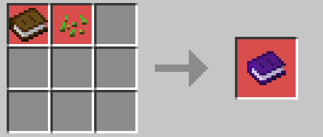

<div align="center">

# 🍳 Wheel of Creation: Agriculture Update II

### _Dieta, Nutrición y Cocina — Minecraft Bedrock_

[](https://minecraft.net)
[](LICENSE)
[](https://www.typescriptlang.org/)

🌐 **[🇺🇸 Read in English](./AGRICULTURE_UPDATE_II_ENGLISH.md)** | **[🇧🇷 Ler em Português](./AGRICULTURE_UPDATE_II_PORTUGUESE.md)**

---

**El segundo capítulo de la Agriculture Update llega con 4 nuevos cultivos, 29 recetas de cocina, un sistema completo de dieta con 7 nutrientes que afecta tus estadísticas de combate, y un rebalanceo de la comida vanilla que hace que cocinar realmente importe.**

> 🎮 **Requiere [Agriculture Update I](./AGRICULTURE_UPDATE_I_SPANISH.md)** — Esta actualización se construye sobre los sistemas de cultivo de la primera entrega. Asegúrate de conocer las mecánicas base antes de sumergirte.


</div>

---

<div align="center">

### ✅ Qué hay de nuevo en Agriculture Update II

</div>

> Esta actualización se centra en **lo que pasa después de la cosecha**. Mientras la Update I reimaginó cómo crecen los cultivos, la Update II reimagina **por qué los cultivas**. La comida ya no son solo puntos de hambre — es un recurso estratégico que impacta directamente tu fuerza, resistencia y salud máxima.

---

## 📋 Tabla de Contenidos

- [Nuevos Cultivos](#-nuevos-cultivos)
    - [Tomates](#-tomates)
    - [Repollos](#-repollos)
    - [Cebollas](#-cebollas)
    - [Arroz (Cultivo Acuático)](#-arroz--cultivo-acuático)
- [Cocina y Recetas](#-cocina-y-recetas)
    - [Ingredientes](#-ingredientes-base)
    - [Emparedados](#-emparedados)
    - [Platos con Cuenco](#-platos-con-cuenco--estofados)
    - [Otras Recetas](#-otras-recetas)
- [Sistema de Dieta y Nutrición](#-sistema-de-dieta-y-nutrición)
    - [Los 7 Grupos de Nutrientes](#-los-7-grupos-de-nutrientes)
    - [Cómo Funciona la Digestión](#-cómo-funciona-la-digestión)
    - [Buffs y Debuffs](#-buffs-y-debuffs)
    - [Libro de Dieta](#-libro-de-dieta)
- [Rebalanceo de Comida Vanilla](#-rebalanceo-de-comida-vanilla)
- [Trades del Granjero Actualizados](#-trades-del-granjero-actualizados)
- [Consejos y Estrategias](#-consejos-y-estrategias)

---

## 🌱 Nuevos Cultivos

Agriculture Update II introduce **4 nuevos cultivos**, cada uno con condiciones de crecimiento y mecánicas únicas. Uno de ellos — el Arroz — introduce una categoría completamente nueva: **Cultivos Acuáticos**.


---

### 🍅 Tomates

El cultivo más productivo del juego, pero también el más exigente. Los tomates tienen la **mayor susceptibilidad a maleza** (18%) de cualquier cultivo, haciendo que las semillas Selectas y el fertilizante sean prácticamente obligatorios.

| Propiedad             | Valor                                 |
| --------------------- | ------------------------------------- |
| **ID**                | `woc:tomatoes`                        |
| **Etapas de Crec.**   | 8 (0–7)                               |
| **Tiempo de Crec.**   | 56 días de juego (~18.7 horas reales) |
| **Rango Hidratación** | 5–7 (muy estrecho)                    |
| **Rango Temperatura** | 15–30°C                               |
| **Drops Base**        | 4 Tomates + 2 Semillas                |
| **Prob. Maleza**      | 18% ⚠️                                |
| **Biomas Preferidos** | Llanuras, Sabana, Jungla, Bosque      |

> 💡 **Consejo**: El rango estrecho de hidratación del tomate (5–7) requiere precisión con la ubicación del agua. Muy húmedo y se pudre, muy seco y se marchita. Usa el Inspector de Cultivos constantemente.


---

### 🥬 Repollos

Una potencia de clima frío. Los repollos prosperan en temperaturas donde la mayoría de cultivos morirían, haciéndolos el complemento perfecto de las Remolachas en biomas helados. También son un ingrediente clave para muchas recetas de cocina.

| Propiedad             | Valor                               |
| --------------------- | ----------------------------------- |
| **ID**                | `woc:cabbages`                      |
| **Etapas de Crec.**   | 8 (0–7)                             |
| **Tiempo de Crec.**   | 72 días de juego (~24 horas reales) |
| **Rango Hidratación** | 4–8                                 |
| **Rango Temperatura** | -10 a 15°C                          |
| **Drops Base**        | 1 Repollo + 2 Semillas              |
| **Prob. Maleza**      | 2%                                  |
| **Biomas Preferidos** | Taiga, Arboleda, Pradera, Fríos     |

> 💡 **Consejo**: Los repollos tienen el tiempo de crecimiento más largo de cualquier cultivo base (72 días). Planifica con antelación y usa fertilizante para acelerarlo. Su bajo riesgo de maleza los hace muy fáciles de mantener una vez plantados.


---

### 🧅 Cebollas

Un cultivo versátil de clima templado que funciona como las zanahorias — la cebolla cosechada se usa para replantar. Las cebollas aparecen en muchas recetas de cocina, convirtiéndolas en un ingrediente básico que siempre querrás tener en stock.

| Propiedad             | Valor                                 |
| --------------------- | ------------------------------------- |
| **ID**                | `woc:onions`                          |
| **Etapas de Crec.**   | 4 (0–3)                               |
| **Tiempo de Crec.**   | 64 días de juego (~21.3 horas reales) |
| **Rango Hidratación** | 3–7                                   |
| **Rango Temperatura** | 5–25°C                                |
| **Drops Base**        | 3 Cebollas                            |
| **Prob. Maleza**      | 6%                                    |
| **Biomas Preferidos** | Llanuras, Pradera, Bosque             |

> 💡 **Consejo**: Como las zanahorias y las patatas, las cebollas usan el cultivo mismo como semilla. Replanta al menos una de cada cosecha para mantener tu suministro.


---

### 🍚 Arroz — Cultivo Acuático

El arroz introduce el primer **Cultivo Acuático** del addon — una categoría completamente nueva. A diferencia de todos los demás cultivos, el arroz **NO** crece en tierra de cultivo. Debe plantarse en bloques de **tierra, barro o hierba** que estén **sumergidos en agua**.

| Propiedad             | Valor                                    |
| --------------------- | ---------------------------------------- |
| **ID**                | `woc:rices`                              |
| **Etapas de Crec.**   | 5 base + 4 panícula                      |
| **Tiempo de Crec.**   | 64 días de juego (~21.3 horas reales)    |
| **Rango Temperatura** | 18–34°C                                  |
| **Drops Base**        | 1 Panícula de Arroz + 1 Semilla          |
| **Suelos Válidos**    | Tierra, Barro, Bloque de Hierba          |
| **Biomas Preferidos** | Pantano, Jungla, Río, Cuevas Exuberantes |

#### Cómo Crece el Arroz

El arroz tiene un sistema único de **crecimiento en dos bloques**:

```
     Fase 1: Base              Fase 2: Panícula
    ┌──────────┐              ┌──────────┐
    │          │              │ 🌾 Panícula│  ← Parte cosechable
    │~~Agua~~~~│              │~~Agua~~~~~│
    │ 🌱 Base  │              │ 🌿 Base   │  ← Sumergida en agua
    │  [Suelo] │              │  [Suelo]  │
    └──────────┘              └──────────┘
    70% del tiempo             30% del tiempo
```

1. **Planta** la panícula de arroz en tierra/barro/hierba sumergido en agua
2. La **base** crece a través de 5 etapas bajo el agua (70% del tiempo)
3. Cuando la base madura, brota una **panícula** sobre el nivel del agua
4. La panícula crece a través de 4 etapas (30% del tiempo)
5. **Cosecha** la panícula madura para obtener Panículas de Arroz y semillas
6. Romper cualquiera de los dos bloques destruye ambos

#### Construyendo un Arrozal

> 🌊 El arrozal ideal es una piscina poco profunda (1 bloque de profundidad) de agua sobre tierra o barro, en un bioma cálido (Pantano, Jungla, Río). Puedes aplicar fertilizante directamente al bloque base para aumentar el rendimiento.


#### Procesamiento del Arroz

Las Panículas de Arroz crudas deben **trillarse** antes de cocinar:

| Entrada                          | Estación     | Resultado |
| -------------------------------- | ------------ | --------- |
| 1× Panícula de Arroz (Silvestre) | Cortapiedras | 1× Arroz  |
| 1× Panícula de Arroz (Selecta)   | Cortapiedras | 2× Arroz  |

---

## 🍳 Cocina y Recetas

Agriculture Update II introduce **29 nuevos alimentos** en múltiples categorías. Cocinar no es solo por diversión — el sistema de dieta hace que cada elección de comida impacte tu rendimiento en combate.


---

### 🥩 Ingredientes Base

Estos son ítems intermedios usados en recetas más complejas.

<details>
<summary><b>🥩 Tocino (Clic para expandir)</b></summary>

| Propiedad    | Valor                                                             |
| ------------ | ----------------------------------------------------------------- |
| **Receta**   | 1× Chuleta de Cerdo Cruda → 2× Tocino                             |
| **Estación** | Cortapiedras                                                      |
| **Uso**      | Ingrediente para emparedados, cocinar en horno para Tocino Cocido |

</details>

<details>
<summary><b>🍳 Huevo Frito (Clic para expandir)</b></summary>

| Propiedad    | Valor                                            |
| ------------ | ------------------------------------------------ |
| **Receta**   | 1× Huevo → 1× Huevo Frito                        |
| **Estación** | Horno / Ahumador                                 |
| **Uso**      | Ingrediente para emparedados y Tocino con Huevos |

</details>

<details>
<summary><b>🥬 Hoja de Repollo (Clic para expandir)</b></summary>

| Propiedad    | Valor                                                               |
| ------------ | ------------------------------------------------------------------- |
| **Receta**   | 1× Repollo → 2× Hoja de Repollo                                     |
| **Estación** | Mesa de Crafteo                                                     |
| **Uso**      | Ingrediente clave para rollos, empanadillas, emparedados, ensaladas |

</details>

<details>
<summary><b>🫓 Masa de Trigo (Clic para expandir)</b></summary>

| Propiedad    | Valor                                                           |
| ------------ | --------------------------------------------------------------- |
| **Receta**   | 8× Trigo + 1× Cubo de Agua → 3× Masa de Trigo (+ devuelve Cubo) |
| **Estación** | Mesa de Crafteo (con forma)                                     |
| **Uso**      | Ingrediente para Pan y Empanadillas                             |

</details>

<details>
<summary><b>🥓 Tocino Cocido (Clic para expandir)</b></summary>

| Propiedad    | Valor                                                     |
| ------------ | --------------------------------------------------------- |
| **Receta**   | 1× Tocino → 1× Tocino Cocido                              |
| **Estación** | Horno / Ahumador                                          |
| **Uso**      | Ingrediente para Emparedado de Tocino y Tocino con Huevos |

</details>

<details>
<summary><b>🍼 Botella de Leche (Clic para expandir)</b></summary>

| Propiedad    | Valor                                                                            |
| ------------ | -------------------------------------------------------------------------------- |
| **Receta**   | 8× Botella de Cristal + 1× Cubo de Leche → 8× Botella de Leche (+ devuelve Cubo) |
| **Estación** | Mesa de Crafteo (con forma)                                                      |
| **Uso**      | Fuente de nutrientes lácteos, apilable a 16                                      |

</details>

<details>
<summary><b>🍞 Pan (Nueva Receta) (Clic para expandir)</b></summary>

| Propiedad    | Valor                                                                     |
| ------------ | ------------------------------------------------------------------------- |
| **Receta**   | 1× Masa de Trigo → 1× Pan                                                 |
| **Estación** | Horno / Ahumador                                                          |
| **Nota**     | Reemplaza la receta vanilla del pan. Ahora requiere Masa de Trigo primero |

</details>

---

### 🥪 Emparedados

Comidas portátiles y apilables, perfectas para aventuras. Todos se apilan a 64.

<details>
<summary><b>🥪 Todas las Recetas de Emparedados (Clic para expandir)</b></summary>

| Emparedado                  | Ingredientes                                   | Resultado               |
| --------------------------- | ---------------------------------------------- | ----------------------- |
| 🥚 **Emparedado de Huevo**  | Huevo Frito + Pan                              | 2× Emparedado de Huevo  |
| 🐔 **Emparedado de Pollo**  | Pollo Cocido + Pan + Hoja de Repollo + Tomate  | 2× Emparedado de Pollo  |
| 🥓 **Emparedado de Tocino** | Tocino Cocido + Pan + Hoja de Repollo + Tomate | 2× Emparedado de Tocino |

Todos se fabrican en la **Mesa de Crafteo** (sin forma).


</details>

---

### 🥣 Platos con Cuenco y Estofados

Comidas consistentes servidas en cuencos. Se apilan a 16 y devuelven el cuenco al comerlas.

<details>
<summary><b>🥩 Estofados de Carne (Clic para expandir)</b></summary>

| Plato                    | Ingredientes                                        | Estación        |
| ------------------------ | --------------------------------------------------- | --------------- |
| 🥩 **Estofado de Carne** | Cuenco + Carne Cocida + Patata al Horno + Zanahoria | Mesa de Crafteo |
| 🍗 **Sopa de Pollo**     | Cuenco + Pollo Cocido + Zanahoria + Cebolla         | Mesa de Crafteo |
| 🥓 **Tocino con Huevos** | Cuenco + Tocino Cocido + Huevo Frito                | Mesa de Crafteo |
| 🦴 **Caldo de Hueso**    | Cuenco + Hueso + Cebolla                            | Mesa de Crafteo |
| 🥩 **Filete con Papas**  | Cuenco + Carne Cocida + Patata al Horno             | Mesa de Crafteo |


</details>

<details>
<summary><b>🐟 Estofados de Pescado (Clic para expandir)</b></summary>

| Plato                      | Ingredientes                                       | Estación        |
| -------------------------- | -------------------------------------------------- | --------------- |
| 🐟 **Estofado de Pescado** | Cuenco + Salmón Cocido + Patata al Horno + Cebolla | Mesa de Crafteo |
| 🐟 **Estofado de Bacalao** | Cuenco + Bacalao Cocido + Patata al Horno + Tomate | Mesa de Crafteo |


</details>

<details>
<summary><b>🥗 Cuencos de Verduras y Arroz (Clic para expandir)</b></summary>

| Plato                        | Ingredientes                                       | Estación        |
| ---------------------------- | -------------------------------------------------- | --------------- |
| 🍚 **Arroz Cocido**          | Cuenco + 2× Arroz                                  | Mesa de Crafteo |
| 🍳 **Arroz Frito**           | Cuenco + Arroz + Huevo + Cebolla                   | Mesa de Crafteo |
| 🍄 **Arroz con Champiñones** | Cuenco + Arroz + Champiñón Marrón + Champiñón Rojo | Mesa de Crafteo |
| 🥗 **Ensalada Mixta**        | Cuenco + Hoja de Repollo + Zanahoria + Tomate      | Mesa de Crafteo |
| 🍅 **Salsa de Tomate**       | Cuenco + 2× Tomate + Cebolla                       | Mesa de Crafteo |
| 🎃 **Sopa de Calabaza**      | Cuenco + Calabaza + Cebolla                        | Mesa de Crafteo |
| 🥬 **Sopa de Verduras**      | Cuenco + Hoja de Repollo + Zanahoria + Cebolla     | Mesa de Crafteo |


</details>

---

### 🥟 Otras Recetas

<details>
<summary><b>🥟 Empanadillas — 5 Variantes (Clic para expandir)</b></summary>

Todas usan la misma base: **Hoja de Repollo + Masa de Trigo + Carne Cocida** → 2× Empanadillas

| Variante                | Carne Usada             |
| ----------------------- | ----------------------- |
| Empanadillas de Res     | Carne de Res Cocida     |
| Empanadillas de Pollo   | Pollo Cocido            |
| Empanadillas de Cordero | Cordero Cocido          |
| Empanadillas de Cerdo   | Chuleta de Cerdo Cocida |
| Empanadillas de Conejo  | Conejo Cocido           |

Se fabrican en la **Mesa de Crafteo** (sin forma).


</details>

<details>
<summary><b>🥬 Rollos de Repollo — 5 Variantes (Clic para expandir)</b></summary>

Todos usan: **Hoja de Repollo + Verdura** → 2× Rollos de Repollo

| Variante            | Relleno   |
| ------------------- | --------- |
| Rollos de Remolacha | Remolacha |
| Rollos de Zanahoria | Zanahoria |
| Rollos de Cebolla   | Cebolla   |
| Rollos de Patata    | Patata    |
| Rollos de Tomate    | Tomate    |

Se fabrican en la **Mesa de Crafteo** (sin forma).


</details>

---

## 🥗 Sistema de Dieta y Nutrición

La pieza central de la Agriculture Update II. Cada alimento que comes contribuye a **7 grupos de nutrientes**, y tu balance nutricional afecta directamente tu **salud máxima, daño de ataque y resistencia al daño**.

Este sistema recompensa la **variedad dietética** y penaliza los hábitos alimenticios monótonos.


---

### 📊 Los 7 Grupos de Nutrientes

| #   | Nutriente        | Icono | Velocidad de Quema | Descripción                               |
| --- | ---------------- | ----- | ------------------ | ----------------------------------------- |
| 0   | 🍎 **Frutas**    | 🔴    | Rápida (1.4×)      | Manzanas, bayas, rodajas de sandía        |
| 1   | 🥩 **Proteínas** | 🟠    | Lenta (0.9×)       | Carne, pescado, huevos                    |
| 2   | 🥬 **Verduras**  | 🟢    | Normal (1.1×)      | Zanahorias, repollos, cebollas, tomates   |
| 3   | 🌾 **Granos**    | 🟡    | Normal (1.0×)      | Pan, arroz, alimentos de trigo            |
| 4   | 🍬 **Azúcares**  | 🟣    | Muy Rápida (1.6×)  | Galletas, pastel, miel, alimentos dorados |
| 5   | 🥛 **Lácteos**   | ⬜    | Lenta (0.7×)       | Botellas de leche                         |
| 6   | 🧈 **Grasas**    | ⬛    | Muy Lenta (0.6×)   | Tocino, carnes cocidas, alimentos grasos  |

> Cada nutriente va de **0% a 100%**. Más alto es mejor — pero mantenerlos todos equilibrados es el verdadero desafío.

---

### ⚙️ Cómo Funciona la Digestión

Tu cuerpo no procesa todos los nutrientes por igual. El sistema simula una digestión realista:

#### Comer y Absorción

- Cuando comes, los nutrientes del alimento se **suman a tu perfil**
- Se rastrea un **historial de los últimos 20 alimentos**
- **Penalización por repetición**: comer el mismo alimento repetidamente reduce su efectividad un 10% por cada repetición en tus últimas 10 comidas (mínimo 20% de efectividad)
- Esto significa que **comer alimentos variados es significativamente más efectivo** que comer bistec sin parar

#### Quema de Nutrientes (Digestión)

- Cada **~20 segundos**, tu cuerpo quema aleatoriamente 1–3 nutrientes
- **Los azúcares se queman más rápido** (1.6×), **las grasas más lento** (0.6×)
- La actividad física acelera la quema: sprint (×2.5), nadar (×2.0), escalar (×1.8)
- Las temperaturas extremas aumentan el consumo de nutrientes (tu cuerpo trabaja más)

#### Sinergias

- Si Azúcares + Granos están ambos altos (>40%), la Proteína y Grasa se queman un 50% más lento (tu cuerpo tiene energía rápida disponible)
- La actividad intensa (sprint) acelera la quema de Frutas y Azúcares específicamente

---

### 💪 Buffs y Debuffs

Tu balance nutricional produce tres estadísticas relevantes para el combate. Se recalculan cada **~60 segundos**.

#### ❤️ Salud Máxima (10–40 HP)

| Peso del Nutriente | Contribución |
| ------------------ | ------------ |
| Azúcares           | 30%          |
| Frutas             | 25%          |
| Verduras           | 20%          |
| Granos             | 15%          |
| Lácteos            | 5%           |
| Grasas             | 5%           |

| Calidad de Dieta | HP Máx    | Corazones |
| ---------------- | --------- | --------- |
| Hambruna         | 10 HP     | 5 ❤️      |
| Pobre            | 14–18 HP  | 7–9 ❤️    |
| **Normal**       | **20 HP** | **10 ❤️** |
| Buena            | 24–28 HP  | 12–14 ❤️  |
| Excelente        | 32–40 HP  | 16–20 ❤️  |

#### ⚔️ Daño de Ataque (×0.6 – ×1.6)

| Peso del Nutriente | Contribución |
| ------------------ | ------------ |
| Proteínas          | 40%          |
| Granos             | 25%          |
| Frutas             | 15%          |
| Azúcares           | 10%          |
| Verduras           | 10%          |

Un guerrero bien alimentado inflige hasta un **60% más de daño**. Uno desnutrido inflige un **40% menos**.

#### 🛡️ Resistencia al Daño (×0.6 – ×1.4)

| Peso del Nutriente | Contribución |
| ------------------ | ------------ |
| Grasas             | 35%          |
| Lácteos            | 25%          |
| Proteínas          | 20%          |
| Granos             | 10%          |
| Verduras           | 10%          |

Con Grasas y Lácteos altos, el daño recibido se reduce hasta un **40%**. Descuidarlos aumenta el daño recibido un **40%**.

> ⚠️ **Factor de Equilibrio**: Subir solo un nutriente mientras ignoras los demás suprime tus buffs. El sistema usa una **curva smoothstep** que recompensa dietas equilibradas sobre maximizar un solo nutriente.

> ℹ️ **Nota**: Los debuffs (estadísticas por debajo de lo normal) pueden desactivarse en la configuración del addon. Los buffs están siempre activos.

---

### 📖 Libro de Dieta

El **Libro de Dieta** es tu ventana al estado nutricional. Fabrica uno y sostenlo para ver tus 7 niveles de nutrientes en la barra de acción.


#### Receta de Fabricación



#### Información Mostrada

Al sostenerlo en la mano:

```
🔴 Frutas: 45%  🟠 Proteínas: 72%  🟢 Verduras: 38%
🟡 Granos: 55%  🟣 Azúcares: 20%  ⬜ Lácteos: 15%  ⬛ Grasas: 60%
```

---

## ⚖️ Rebalanceo de Comida Vanilla

Agriculture Update II **rebalancea todos los alimentos vanilla** para que el sistema de cocina sea significativo. Los alimentos vanilla ahora proporcionan significativamente menos nutrición y saturación.

<details>
<summary><b>📊 Cambios Completos de Comida Vanilla (Clic para expandir)</b></summary>

| Alimento                | Nutrición Original | Nueva Nutrición | Cambio |
| ----------------------- | ------------------ | --------------- | ------ |
| Carne de Res Cocida     | 8                  | 3               | -62%   |
| Chuleta de Cerdo Cocida | 8                  | 3               | -62%   |
| Pollo Cocido            | 6                  | 3               | -50%   |
| Cordero Cocido          | 6                  | 3               | -50%   |
| Pan                     | 5                  | 3               | -40%   |
| Patata al Horno         | 5                  | 2               | -60%   |
| Salmón Cocido           | 6                  | 3               | -50%   |
| Bacalao Cocido          | 5                  | 3               | -40%   |
| Manzana                 | 4                  | 2               | -50%   |
| Zanahoria               | 3                  | 1               | -67%   |
| Patata                  | 1                  | 1               | —      |
| Remolacha               | 1                  | 1               | —      |

> 💡 **¿Por qué?** Un simple filete no debería ser tan efectivo como un Estofado de Carne cuidadosamente preparado con patatas y zanahorias. Este rebalanceo crea una curva de progresión donde cocinar se convierte en una ventaja genuina de supervivencia.

</details>

---

## 🏪 Trades del Granjero Actualizados

Los Aldeanos Granjeros ahora ofrecen intercambios por todos los nuevos cultivos y semillas en el **Tier 4** (se requieren 150 XP).

<details>
<summary><b>🏪 Nuevos Trades del Granjero — Tier 4 (Clic para expandir)</b></summary>

#### Compra (El Granjero te compra)

| Cultivo | Cantidad | Precio      |
| ------- | -------- | ----------- |
| Tomate  | 20       | 1 Esmeralda |
| Repollo | 12       | 1 Esmeralda |
| Cebolla | 22       | 1 Esmeralda |
| Arroz   | 26       | 1 Esmeralda |

#### Venta (El Granjero te vende)

| Semilla                      | Precio       |
| ---------------------------- | ------------ |
| Semillas de Tomate Selectas  | 6 Esmeraldas |
| Semillas de Repollo Selectas | 6 Esmeraldas |
| Cebolla Selecta              | 6 Esmeraldas |
| Panícula de Arroz Selecta    | 6 Esmeraldas |

</details>

---

## 💡 Consejos y Estrategias

### 🏆 Estrategias de Dieta

<details>
<summary><b>🌟 Principiante: Empezando con la Nutrición</b></summary>

1. Fabrica un **Libro de Dieta** lo antes posible
2. Enfócate en cultivar **Trigo** (Granos), **Zanahorias** (Verduras), y recolectar **Manzanas** (Frutas) primero
3. Cocina **Pan** de Masa de Trigo para un aporte constante de Granos
4. Prepara **Ensaladas Mixtas** para nutrientes vegetales
5. No comas el mismo alimento más de dos veces seguidas — ¡la variedad es clave!

</details>

<details>
<summary><b>🌟 Intermedio: Build de Combate Equilibrado</b></summary>

1. Establece granjas para los **4 nuevos cultivos** en biomas apropiados
2. Rota entre **Estofado de Carne** (Proteína + Granos), **Ensalada Mixta** (Verduras), y **Fruta** (Manzanas/Bayas)
3. Usa **Botellas de Leche** para Lácteos — fabrica en cantidad
4. Mantén **Tocino** en stock para Grasas
5. Monitorea tu Libro de Dieta y atiende cualquier nutriente que baje del 30%

</details>

<details>
<summary><b>🌟 Avanzado: Maximizando Estadísticas de Combate</b></summary>

1. **Para máximo daño**: Prioriza Proteínas (estofados de carne, empanadillas) y Granos (pan, arroz)
2. **Para máximo HP**: Equilibra Azúcares (galletas, miel), Frutas, y Verduras
3. **Para máxima resistencia**: Acumula Grasas (tocino) y Lácteos (botellas de leche)
4. Usa **sinergias**: mantén Azúcares + Granos por encima del 40% para ralentizar la quema de Proteína/Grasa
5. Antes de peleas contra jefes, come un conjunto diverso de alimentos para llenar todos los nutrientes
6. Explota la penalización por repetición: rota entre 5+ tipos de alimentos diferentes

</details>

### ⚠️ Errores Comunes

| Error                            | Por qué es malo                                      | Solución                               |
| -------------------------------- | ---------------------------------------------------- | -------------------------------------- |
| Comer carne cocida sin parar     | La penalización por repetición reduce la efectividad | Rota entre diferentes alimentos        |
| Ignorar Grasas y Lácteos         | Recibes 40% más de daño                              | Come tocino y botellas de leche        |
| No cultivar arroz                | Te pierdes ingrediente clave para múltiples recetas  | Construye un arrozal en un pantano     |
| Plantar tomates sin fertilizante | 18% de prob. de maleza arruinará tu cultivo          | Siempre fertiliza los campos de tomate |
| Olvidar trillar el arroz         | Las panículas crudas no sirven en recetas            | Usa el cortapiedras                    |

---

<div align="center">

### 📌 Más Actualizaciones por Venir

Agriculture Update II es parte de la serie de addons **Wheel of Creation** en desarrollo. Mantente atento a futuras actualizaciones que expandirán la jugabilidad aún más.

---

**[← Volver a Agriculture Update I](./AGRICULTURE_UPDATE_I_SPANISH.md)** | **[↑ Volver al README Principal](../../README.md)**

---

_Última Actualización: Febrero 2026 | Versión 0.0.2 | Agriculture Update II_

**Hecho con ❤️ por HormigaDev — Código abierto bajo GPL-3.0**


</div>
