<div align="center">

# 🌾 Wheel of Creation: Agriculture Update

### _Uma Revolução Agrícola Realista para Minecraft Bedrock_

[](https://minecraft.net)
[](LICENSE)
[](https://www.typescriptlang.org/)

---

**Transforme sua experiência de agricultura no Minecraft com um sistema agrícola abrangente que introduz mecânicas climáticas baseadas em biomas, genética de culturas, hidratação do solo e ciclos reais de crescimento de plantas.**

> 🎮 **Inspirado no [TerraFirmaCraft](https://terrafirmacraft.com/)** — Este addon se inspira em algumas mecânicas do popular mod de Java TerraFirmaCraft. No entanto, **NÃO** é um port oficial. Todos os sistemas foram completamente reimaginados e reinterpretados para o Minecraft Bedrock Edition por **HormigaDev**.

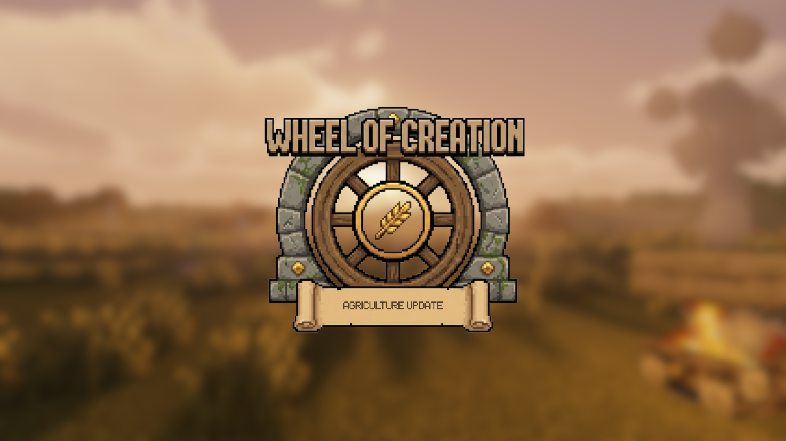

</div>

---

<div align="center">

### 🌾 Agriculture Update I — Parte de uma Série em Expansão

Esta é a **primeira versão** da série Agriculture Update. A **Agriculture Update II** já está disponível com:

🥗 **Sistema de Dieta e Nutrição** | 🍳 **29 Receitas de Culinária** | 🌽 **4 Novas Culturas (Tomate, Repolho, Cebola, Arroz)** | 🥧 **Processamento de Alimentos e Rebalanceamento Vanilla**

👉 **[Ler Agriculture Update II](./AGRICULTURE_UPDATE_II_PORTUGUESE.md)**

</div>

---

<div align="center">

### ✅ 100% FUNCIONAL — Leia Antes de Jogar!

</div>

> 📢 **Esclarecimento Importante**: Este addon foca nas **mecânicas de cultivo** e é a primeira de muitas atualizações planejadas. No entanto, isso **NÃO** significa que o addon está incompleto ou que algo não funciona corretamente.
>
> 🎮 **O addon é 100% funcional e está pronto para jogar.** Todos os sistemas de cultivo, mecânicas climáticas, genética, compostagem e ferramentas funcionam exatamente como projetado. Você pode instalá-lo agora mesmo e aproveitar uma experiência agrícola completa e polida.
>
> 🔧 **Por que "Update I"?** Há muitas outras funcionalidades em desenvolvimento ativo que expandirão o addon ao longo do tempo. Ao lançar em atualizações, posso entregar conteúdo de qualidade mais cedo e coletar feedback valioso dos jogadores.
>
> 💬 **Seu feedback importa!** Se você jogar e compartilhar sua experiência, me ajudará a balancear melhor as mecânicas. Reporte bugs, sugira ajustes, ou simplesmente me conte o que pensa — a comunidade molda este projeto.

---

## 📋 Tabela de Conteúdos

- [Visão Geral](#-visão-geral)
- [Principais Funcionalidades](#-principais-funcionalidades)
- [Primeiros Passos](#-primeiros-passos)
- [Mecânicas de Jogo](#-mecânicas-de-jogo)
    - [Sistema de Clima](#-sistema-de-clima)
    - [Solo e Hidratação](#-solo--hidratação)
    - [Tipos de Culturas](#-tipos-de-culturas)
    - [Sistema de Qualidade de Culturas](#-sistema-de-qualidade-de-culturas)
    - [Composteira Melhorada](#-composteira-melhorada)
    - [Inspetor de Culturas](#-inspetor-de-culturas)
- [Guia de Referência de Culturas](#-guia-de-referência-de-culturas)
- [Compatibilidade de Biomas](#-compatibilidade-de-biomas)
- [Dicas e Estratégias](#-dicas--estratégias)
- [Instalação](#-instalação)
- [Créditos](#-créditos)

---

## 🌍 Visão Geral

**Wheel of Creation: Agriculture Update** reimagina o sistema de agricultura do Minecraft do zero. Esqueça o uso infinito de farelo de osso e campos de cultivo ilimitados. Este addon introduz uma simulação agrícola sofisticada onde:

- 🌡️ **A temperatura importa** — As plantas têm faixas ideais de temperatura e podem morrer devido ao calor ou frio extremo.
- 💧 **A hidratação é dinâmica** — Os níveis de umidade do solo flutuam com base no bioma, clima e proximidade da água.
- 🧬 **A genética afeta a colheita** — Sementes "Selvagens" vs. "Selecionadas" produzem resultados dramaticamente diferentes.
- 🌿 **Ervas daninhas competem** — Plantações negligenciadas podem ser dominadas por espécies invasoras.
- 🍂 **Culturas podem falhar** — Seca, apodrecimento e extremos de temperatura podem matar suas plantas.
- ⏰ **Crescimento Offline** — As plantações crescem mesmo com chunks descarregados! Explore livremente!

---

<div align="center">

### ⏰ CRESCIMENTO OFFLINE REAL — Uma Revolução!

</div>

> 🚀 **Não precisa ficar perto da sua fazenda!** Diferente do Minecraft vanilla, as plantações neste addon **crescem mesmo quando os chunks estão descarregados**. Como os tempos de crescimento são realisticamente longos (dias a semanas), você pode explorar o mundo livremente, minerar ou embarcar em aventuras. Quando você retornar e o jogo atribuir um random tick ao bloco da plantação, **ele calculará automaticamente todo o tempo decorrido** e determinará:
>
> - ✅ Quantos estágios de crescimento deveriam ter passado
> - ✅ Se a plantação já deveria estar madura
> - ✅ Se as condições ambientais causaram morte durante sua ausência
>
> **Isso NÃO é um detalhe menor** — muda completamente como você pode jogar!

---

<div align="center">

### 🌐 PERFEITO PARA SERVIDORES MULTIPLAYER!

</div>

> 🎮 **Dê propósito ao papel de Fazendeiro!** Este addon é ideal para **servidores multiplayer** (testado em servidores de terceiros, **ainda não testado em Realms**). As mecânicas realistas de agricultura criam uma necessidade genuína de fazendeiros dedicados:
>
> - 👨‍🌾 **Jogadores fazendeiros se tornam essenciais** — Nem todos conseguem cultivar eficientemente
> - 📈 **Crie economias movidas por jogadores** — Fazendeiros podem comercializar suas colheitas valiosas
> - 🏘️ **Incentive a especialização** — Alguns cultivam, outros exploram, outros constroem
> - 🤝 **Promova a cooperação comunitária** — Vilas precisam de fazendeiros para prosperar
>
> **Transforme a economia do seu servidor com uma jogabilidade agrícola significativa!**

---

## ✨ Principais Funcionalidades

<table>
<tr>
<td width="50%">

### 🌡️ Clima Baseado em Biomas

Cada bioma possui características únicas:

- Umidade base (0-10)
- Temperatura (°C)
- Taxa de evaporação
- Probabilidade de apodrecimento
- Chance de ervas daninhas
- Sensibilidade à chuva

</td>
<td width="50%">

### 💧 Sistema de Solo Dinâmico

O bloco de terra arada customizado monitora:

- Nível de hidratação (0-10)
- Nivel de fertilizante (0-10)
- Mudanças visuais de textura
- Responsividade ao clima

</td>
</tr>
<tr>
<td>

### 🌱 Ciclos de Crescimento Realistas

As plantas levam tempo real para amadurecer:

- Trigo: ~48 dias no jogo
- Batatas: ~60 dias no jogo
- Abóboras/Melancias: Ciclos de ~64 dias (caule + fruto)
- Velocidade afetada pelas condições

</td>
<td>

### 🧬 Sistema de Genética de Sementes

Dois níveis de qualidade para sementes:

- **Selvagem (Padrão)**: Menor rendimento, maior risco de ervas daninhas.
- **Selecionada (Premium)**: Maior rendimento, resistência a doenças.

</td>
</tr>
</table>

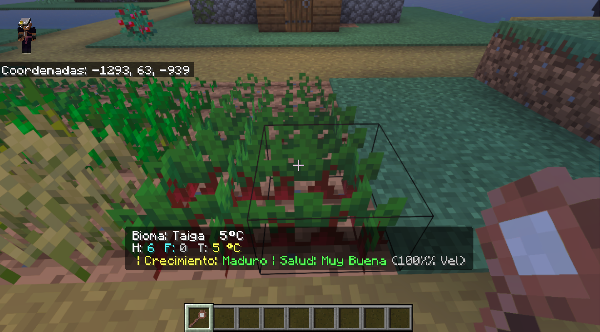

---

## 🚀 Primeiros Passos

### Primeiros Passos

1. **Crie uma Enxada** — Qualquer enxada funcionará.
2. **Prepare o Solo** — Use a enxada em blocos de grama/terra para criar `woc:farmland`.
3. **Verifique as Condições** — Fabrique um **Inspetor de Culturas** para analisar o solo e o clima.
4. **Escolha com Sabedoria** — Plante culturas adequadas à temperatura e umidade do seu bioma.
5. **Mantenha sua Fazenda** — Aplique fertilizante, garanta fontes de água e monitore a saúde.

### Dicas Rápidas para Iniciantes

> ⚠️ **Importante**: Sementes padrão do Minecraft (`minecraft:wheat_seeds`) produzem culturas "Selvagens". Para melhores colheitas, você precisa obter sementes "Selecionadas" através de uma agricultura cuidadosa.

---

## ⚙️ Mecânicas de Jogo

### 🌡️ Sistema de Clima

Cada bioma no Minecraft agora tem um perfil climático completo que afeta a agricultura:

```
┌─────────────────────────────────────────────────────────────┐
│  ESTRUTURA DE DADOS DO BIOMA                                │
├─────────────────────────────────────────────────────────────┤
│  [0] Umidade Base       (0-10)    - Umidade inicial do solo │
│  [1] Temperatura        (°C)      - Sobrevivência da planta │
│  [2] Fator de Evaporação (0-1)     - Prob. perda de água     │
│  [3] Fator de Apodrecimento (0-1) - Prob. de doença         │
│  [4] Chance Erva Daninha (0-1)    - Risco plantas parasitas │
│  [5] Sensibilidade Chuva (0-1)    - Impacto climático       │
└─────────────────────────────────────────────────────────────┘
```

#### Exemplos de Clima:

| Bioma            | Umidade | Temp (°C) | Evap. | Apod. | Ervas | Sens. Chuva |
| ---------------- | :-----: | :-------: | :---: | :---: | :---: | :---------: |
| 🏜️ Deserto       |    0    |    45     |  40%  |  0%   |  0%   |     90%     |
| 🌴 Selva         |    9    |    30     |  0%   |  3%   |  12%  |     80%     |
| 🌲 Taiga         |    6    |     5     |  2%   |  1%   |  2%   |     40%     |
| 🌻 Planície      |    5    |    18     |  2%   |  1%   |  5%   |     40%     |
| ❄️ Picos Gelados |    0    |    -25    |  25%  |  0%   |  0%   |     0%      |
| 🍄 Ilha Cogumelo |   10    |    20     |  0%   |  5%   |  8%   |     90%     |

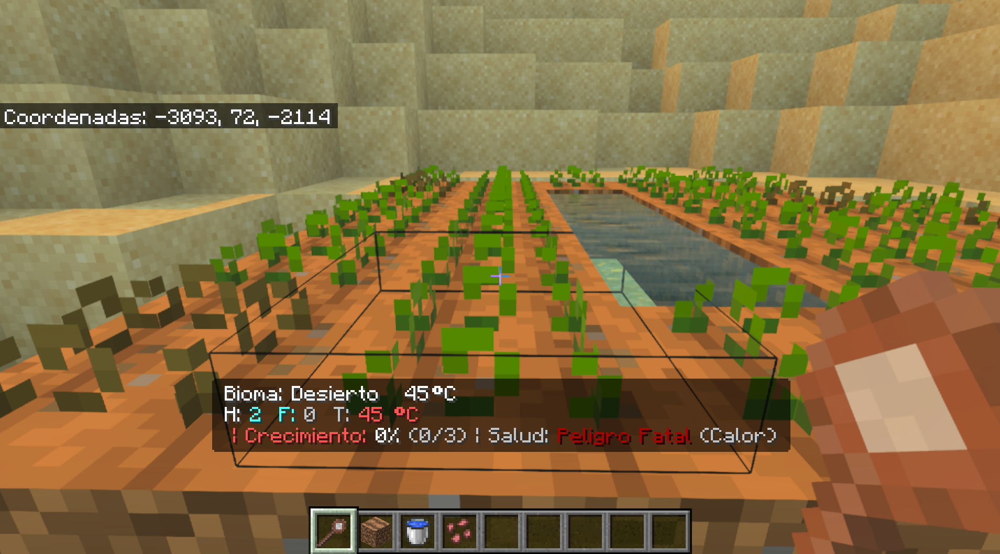
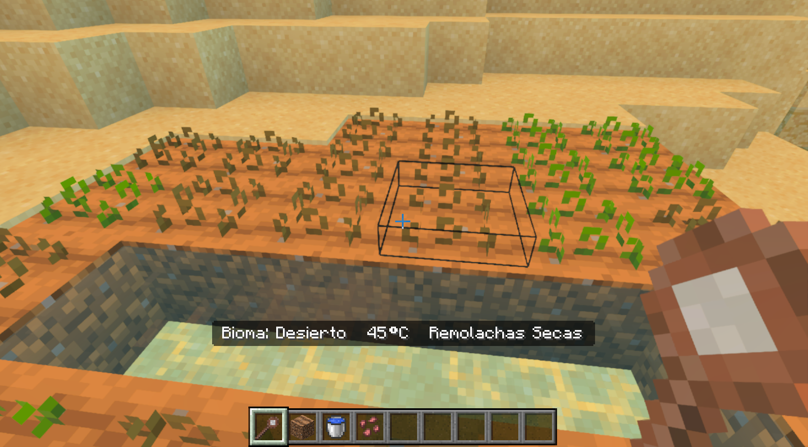

---

### 💧 Solo e Hidratação

O bloco de **Terra Arada** customizado (`woc:farmland`) é a base da agricultura. Ele monitora e exibe ativamente os níveis de umidade.

#### Mecânicas de Hidratação

- **Fontes de Água**: Cada bloco de água num raio de 3 blocos adiciona +2 de hidratação (máx +4).
- **Altitude**: Altitudes elevadas reduzem a umidade, altitudes baixas a aumentam.
- **Clima**: A chuva aumenta a hidratação na maioria dos biomas (efeito reduzido em zonas áridas).
- **Temperatura**: Temperaturas altas (>35°C) reduzem a hidratação em 2.

#### Feedback Visual

| Nível de Hidratação | Aparência                      |
| :-----------------: | ------------------------------ |
|         0-7         | Textura seca (aspecto rachado) |
|        8-10         | Textura úmida (solo escuro)    |

#### Sistema de Fertilizante

Aplique **Fertilizante** na terra arada para impulsionar o desempenho:

- **Nível Máximo**: 10 unidades por bloco.
- **Efeitos**:
    - 🚀 Aumento da velocidade de crescimento.
    - 🌾 Maiores colheitas (+50% por nível de fertilizante).
    - 🛡️ Redução da probabilidade de ervas daninhas.
    - 📈 Vida útil estendida para plantas de caule/coluna.

> 💡 **Dica Pro**: O fertilizante é consumido gradualmente conforme as plantas crescem. Verifique seu solo regularmente!

---

### 🌾 Tipos de Culturas

O addon apresenta três categorias distintas de plantas, cada uma com mecânicas únicas:

#### 1️⃣ Culturas Base

_Plantações tradicionais em fileiras que crescem em estágios verticais_

| Cultura       | Estágios | Tempo Crec. | Hidro Mín | Hidro Máx | Faixa Temp | Biomas Preferidos         |
| ------------- | :------: | :---------: | :-------: | :-------: | :--------: | ------------------------- |
| 🌾 Trigo      |    7     |   48 dias   |     2     |     9     |   5-32°C   | Planície, Girassol, Prado |
| 🥕 Cenouras   |    3     |   32 dias   |     4     |     8     |   8-26°C   | Taiga, Arvoredo, Floresta |
| 🥔 Batatas    |    3     |   60 dias   |     4     |     7     |  10-24°C   | Savana, Colinas, Mesa     |
| 🫒 Beterrabas |    3     |   24 dias   |     2     |     9     |  -5-18°C   | Neve, Gelo, Frio          |

#### 2️⃣ Culturas de Caule

_Produzem múltiplos frutos ao longo de sua vida_

| Cultura     | Crec. Caule | Ciclo Fruto | Frutos Mín | Frutos Máx | Biomas Preferidos         |
| ----------- | :---------: | :---------: | :--------: | :--------: | ------------------------- |
| 🎃 Abóbora  |   64 dias   |   10 dias   |     3      |     8      | Planície, Floresta, Prado |
| 🍈 Melancia |   64 dias   |   8 dias    |     4      |     10     | Selva, Pântano, Rio       |

**Ciclo de Vida de Culturas de Caule**:

1. Plantar semente → O caule cresce através de 7 estágios.
2. Na maturidade → O caule produz frutos em blocos adjacentes.
3. O caule continua produzindo até atingir sua vida útil máxima.
4. Sementes de qualidade produzem mais frutos por um período maior.

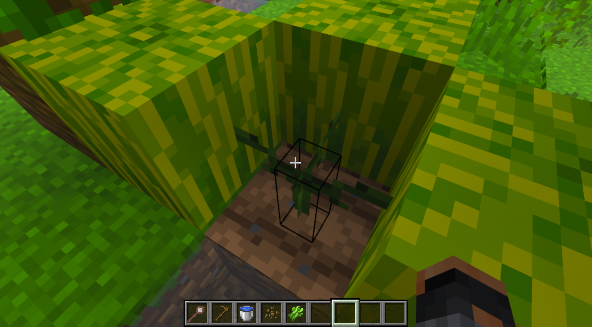
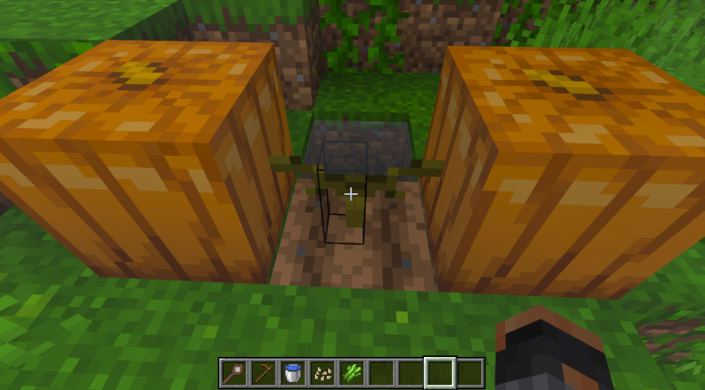

#### 3️⃣ Culturas de Coluna

_Plantas de crescimento vertical com requisitos únicos_

| Cultura           | Altura Máx | Tempo Crec. | Água Requerida | Biomas Preferidos          |
| ----------------- | :--------: | :---------: | :------------: | -------------------------- |
| 🎋 Cana-de-Açúcar |  3 blocos  | 16 dias/seg |  ✅ Adjacente  | Pântano, Selva, Rio, Praia |

**Mecânicas de Cultura de Coluna**:

- O bloco inferior é o "cérebro" que controla o crescimento.
- Novos segmentos surgem acima até a altura máxima.
- Requer fonte de água adjacente (ou terra arada com alta hidratação).
- Cada raiz pode produzir segmentos limitados antes de morrer.

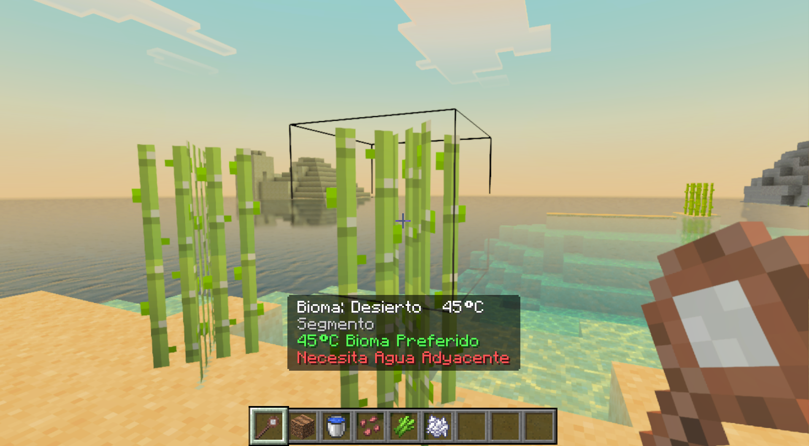

---

### 🧬 Sistema de Qualidade de Culturas

Uma das funcionalidades mais impactantes é o sistema de **qualidade genética**:

<table>
<tr>
<th width="50%">🌿 Qualidade Selvagem</th>
<th width="50%">⭐ Qualidade Selecionada</th>
</tr>
<tr>
<td>

- Obtida de sementes vanilla do Minecraft.
- **70% de velocidade de crescimento**.
- **50% de colheita base**.
- Maior chance de ervas daninhas (100%).
- Maior chance de apodrecimento (200%).
- Menor produção de frutos para caules.
- 50% de chance de dropar sementes Selecionadas na colheita.

</td>
<td>

- Obtida de sementes com o prefixo `woc:`.
- **100% de velocidade de crescimento**.
- **100%+ de colheita base**.
- Chance reduzida de ervas daninhas (5-10%).
- Chance normal de apodrecimento (100%).
- Produção máxima de frutos para caules.
- Sempre dropa sementes Selecionadas.

</td>
</tr>
</table>

#### Como Obter Sementes Selecionadas

> 🏆 **Fonte Principal: Vilões Fazendeiros!**
>
> A forma mais confiável de obter sementes Selecionadas é através da **troca com Villagers Fazendeiros**. Eles oferecem sementes Selecionadas de alta qualidade como parte de seu inventário de trocas. Este é o método recomendado para iniciar sua coleção de sementes premium!

| Tipo de Semente      | Como Obter                                            |
| -------------------- | ----------------------------------------------------- |
| `woc:wheat_seeds`    | 🏪 **Villager Fazendeiro** ou colheita Selvagem (50%) |
| `woc:beetroot_seeds` | 🏪 **Villager Fazendeiro** ou colheita Selvagem (50%) |
| `woc:carrot`         | 🏪 **Villager Fazendeiro** ou colheita Selvagem (50%) |
| `woc:potato`         | 🏪 **Villager Fazendeiro** ou colheita Selvagem (50%) |
| `woc:melon_seeds`    | 🏪 **Villager Fazendeiro** ou colheita caulem Selv.   |
| `woc:pumpkin_seeds`  | 🏪 **Villager Fazendeiro** ou colheita caulem Selv.   |

> 💡 **Dica Pro**: Encontre uma vila cedo e proteja seus Fazendeiros! Eles são a chave para o sucesso agrícola.

#### Comparação entre sementes selvagens e sementes selecionadas

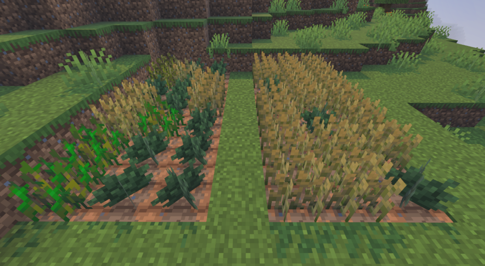

---

### ♻️ Composteira Melhorada

Uma revisão completa do sistema de compostagem que produz **Fertilizante**:

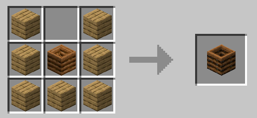
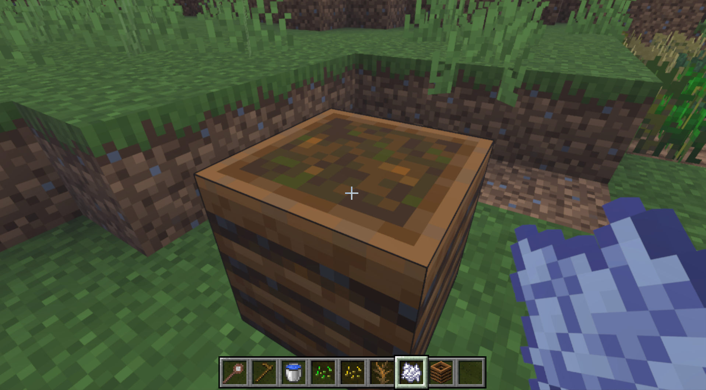

#### Como Funciona

A Composteira Melhorada requer **insumos equilibrados** de dois tipos de materiais:

<table>
<tr>
<th>🟢 Materiais Verdes (Nitrogênio)</th>
<th>🟤 Materiais Marrons (Carbono)</th>
</tr>
<tr>
<td>

**Alto Nível (100% sucesso)**

- Bloco de Melancia, Abóbora
- Bloco de Feno, Bolo

**Nível Médio (85% sucesso)**

- Trigo, Cenoura, Batata, Beterraba
- Fatia de Melancia, Cacto, Vinhas
- Vitória-régia, Todas as Folhas

**Baixo Nível (50% sucesso)**

- Todas as Sementes, Algas
- Grama, Samambaia

</td>
<td>

**Alto Nível (100% sucesso)**

- Caules de Cogumelo
- Blocos de Cogumelo

**Nível Médio (85% sucesso)**

- Cogumelos Marrons/Vermelhos
- Terra Infértil, Podzol
- Arbusto Morto

**Baixo Nível (50% sucesso)**

- Gravetos
- Raízes Penduradas, Algas Secas
- Raízes de Mangue

</td>
</tr>
</table>

#### Processo de Compostagem

```
    Encha Ambos os Lados     Use Farelo de Osso        Coleta Fertilizante
         ↓                       ↓                        ↓
┌────────────────┐      ┌────────────────┐      ┌────────────────┐
│  🟢🟢🟢🟢     │      │                │      │                │
│  ═══════════  │  →   │   ✨ ATIVAR     │  →   │  💚 4-8 Fert.  │
│  🟤🟤🟤🟤     │      │                │      │                │
└────────────────┘      └────────────────┘      └────────────────┘
 (4 Verdes + 4 Marrons)   (Farelo de Osso)      (Resultado aleatório)
```

#### Indicadores Visuais

- O nível de enchimento sobe conforme os materiais são adicionados.
- Faíscas verdes = Sucesso com material verde.
- Partículas marrons = Sucesso com material marrom.
- Fumaça = O material falhou na compostagem.

---

### 🔍 Inspetor de Culturas

O **Inspetor de Culturas** é uma ferramenta essencial. Segure-o na mão principal para ver informações em tempo real na barra de ação.

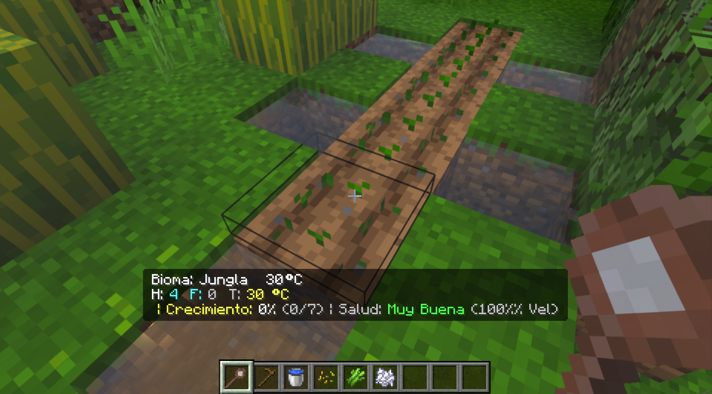


#### Informações Exibidas

**Ao olhar para o céu/nada:**

```
Bioma: Planície   18°C
```

**Ao olhar para Terra Arada:**

```
Bioma: Planície   18°C
H: 7  F: 3  T: 18°C
Solo Pronto para Plantio
```

**Ao olhar para uma Planta em Crescimento:**

```
Bioma: Planície   18°C
H: 7  F: 3  T: 18°C
| Crescimento: 45% (3/7) | Saúde: Muito Boa (100% Vel.)
```

**Ao olhar para uma Cultura de Caule Madura:**

```
Bioma: Selva   30°C
H: 9  F: 5  T: 30°C
| Colheita: 4 / 8 Frutos (Selec.) | Saúde: Ideal (120% Vel.)
```

#### Indicadores de Status de Saúde

| Status        |     Color     | Significado                                        |
| ------------- | :-----------: | -------------------------------------------------- |
| Ideal         |    🟣 Roxo    | Vel. máxima (120%), fertilizado + condições ideais |
| Muito Boa     |   🟢 Verde    | Vel. normal (100%), todas as condições atendidas   |
| Boa           |  🟡 Amarelo   | Crescimento estável, pequenas imperfeições         |
| Regular       |  🟠 Laranja   | Condições subótimas                                |
| Ruim (Água)   |  🔴 Vermelho  | Falta de água, crescimento reduzido                |
| Dormente      |    🔵 Azul    | Muito frio, crescimento pausado                    |
| Fatal (Apod.) | ⚫ Verm. Esc. | Morrendo por excesso de umidade                    |
| Fatal (Seco)  | ⚫ Verm. Esc. | Morrendo por desidratação                          |
| Fatal (Calor) | ⚫ Verm. Esc. | Morrendo por calor extremo                         |
| Fatal (Frio)  | ⚫ Verm. Esc. | Morrendo por frio extremo                          |

**Ao olhar para a Composteira Melhorada:**

```
Status da Composteira:
Verde: 3/4  Marrom: 2/4
Adicione Materiais...
```

**Ao olhar para Plantas Mortas:**

```
Bioma: Deserto   45°C
   Trigo Morto
```

#### Receita de Fabricação

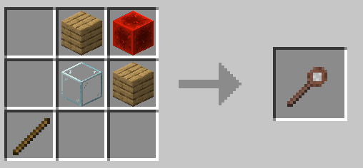

---

## 📊 Guia de Referência de Culturas

### Especificações Completas das Culturas

<details>
<summary><b>🌾 Trigo (Clique para expandir)</b></summary>

| Propriedade           | Valor                                 |
| --------------------- | ------------------------------------- |
| **ID**                | `woc:wheat`                           |
| **Estágios Crec.**    | 7                                     |
| **Tempo Crec.**       | 48 dias no jogo (~16 horas reais)     |
| **Faixa Hidratação**  | 2-9                                   |
| **Faixa Temperatura** | 5-32°C                                |
| **Drops Base**        | 1 Trigo                               |
| **Drops Semente**     | 2 Sementes                            |
| **Prob. Ervas**       | 5%                                    |
| **Biomas Preferidos** | Planície, Planície de Girassol, Prado |

**Dicas:**

- Planta mais versátil, tolera ampla faixa de umidade.
- Excelente para iniciantes.
- Cresce bem em biomas temperados.

</details>

<details>
<summary><b>🥕 Cenouras (Clique para expandir)</b></summary>

| Propriedade           | Valor                            |
| --------------------- | -------------------------------- |
| **ID**                | `woc:carrots`                    |
| **Estágios Crec.**    | 3                                |
| **Tempo Crec.**       | 32 dias no jogo                  |
| **Faixa Hidratação**  | 4-8                              |
| **Faixa Temperatura** | 8-26°C                           |
| **Drops Base**        | 2 Cenouras                       |
| **Drops Semente**     | 0 (usa a cenoura como semente)   |
| **Prob. Ervas**       | 2%                               |
| **Biomas Preferidos** | Taiga, Arvoredo, Prado, Floresta |

**Dicas:**

- Baixo risco de ervas daninhas as torna confiáveis.
- Preferem áreas florestais mais frescas.
- Requisitos médios de umidade.

</details>

<details>
<summary><b>🥔 Batatas (Clique para expandir)</b></summary>

| Propriedade           | Valor                             |
| --------------------- | --------------------------------- |
| **ID**                | `woc:potatoes`                    |
| **Estágios Crec.**    | 3                                 |
| **Tempo Crec.**       | 60 dias no jogo (~20 horas reais) |
| **Faixa Hidratação**  | 4-7                               |
| **Faixa Temperatura** | 10-24°C                           |
| **Drops Base**        | 3 Batatas                         |
| **Drops Semente**     | 0 (usa a batata como semente)     |
| **Prob. Ervas**       | 15%                               |
| **Biomas Preferidos** | Savana, Colinas, Montanha, Mesa   |

**Dicas:**

- Alta chance de ervas daninhas - use sementes Selecionadas!
- Tolerância estreita à umidade.
- Tempo de crescimento longo, mas alto rendimento.
- Prospera em biomas secos e elevados.

</details>

<details>
<summary><b>🫒 Beterrabas (Clique para expandir)</b></summary>

| Propriedade           | Valor                            |
| --------------------- | -------------------------------- |
| **ID**                | `woc:beetroots`                  |
| **Estágios Crec.**    | 3                                |
| **Tempo Crec.**       | 24 dias no jogo (~8 horas reais) |
| **Faixa Hidratação**  | 2-9                              |
| **Faixa Temperatura** | -5 a 18°C                        |
| **Drops Base**        | 1 Beterraba                      |
| **Drops Semente**     | 1 Semente                        |
| **Prob. Ervas**       | 8%                               |
| **Biomas Preferidos** | Neve, Gelo, Frio, Congelado      |

**Dicas:**

- Única planta que prospera em temperaturas negativas!
- Cultura base de crescimento mais rápido.
- Ampla tolerância à umidade.
- Perfeita para fazendas em biomas gelados.

</details>

<details>
<summary><b>🎃 Abóbora (Clique para expandir)</b></summary>

| Propriedade           | Valor                                        |
| --------------------- | -------------------------------------------- |
| **ID**                | `woc:pumpkin_stem`                           |
| **Estágios Caule**    | 7                                            |
| **Tempo Crec. Caule** | 64 dias no jogo                              |
| **Ciclo de Fruto**    | 10 dias por fruto                            |
| **Faixa Hidratação**  | 3-8                                          |
| **Faixa Temperatura** | 5-35°C                                       |
| **Min/Max Frutos**    | 3-8 por vida útil                            |
| **Prob. Ervas**       | 3%                                           |
| **Biomas Preferidos** | Planície, Floresta, Colinas, Prado, Montanha |

**Dicas:**

- Faixa de temperatura muito flexível.
- Requisitos de água médios.
- Baixo risco de ervas daninhas.
- Ótima para fazendas em terras altas temperadas.

</details>

<details>
<summary><b>🍈 Melancia (Clique para expandir)</b></summary>

| Propriedade           | Valor               |
| --------------------- | ------------------- |
| **ID**                | `woc:melon_stem`    |
| **Estágios Caule**    | 7                   |
| **Tempo Crec. Caule** | 64 dias no jogo     |
| **Ciclo de Fruto**    | 8 dias por fruto    |
| **Faixa Hidratação**  | 6-9                 |
| **Faixa Temperatura** | 18-45°C             |
| **Min/Max Frutos**    | 4-10 por vida útil  |
| **Prob. Ervas**       | 8%                  |
| **Biomas Preferidos** | Selva, Pântano, Rio |

**Dicas:**

- Requer alta umidade e temperatura.
- Produção de frutos mais rápida entre os caules.
- Maior risco de ervas daninhas - use fertilizante!
- Prospera em biomas tropicais.

</details>

<details>
<summary><b>🎋 Cana-de-Açúcar (Clique para expandir)</b></summary>

| Propriedade           | Valor                               |
| --------------------- | ----------------------------------- |
| **ID**                | `woc:column_sugar_cane`             |
| **Altura Máxima**     | 3 blocos                            |
| **Tempo Crecimento**  | 16 dias por segmento                |
| **Faixa Hidratação**  | 8-10                                |
| **Faixa Temperatura** | 10-45°C                             |
| **Água Requerida**    | ✅ Adjacente ou alta hidratação     |
| **Drops Base**        | 1 por segmento                      |
| **Prob. Ervas**       | 1%                                  |
| **Biomas Preferidos** | Pântano, Rio, Selva, Praia, Deserto |

**Dicas:**

- Risco baixíssimo de ervas daninhas.
- Requer fonte de água próxima OU terra arada com hidratação 8+.
- Tolerância térmica extrema.
- Cada raiz produz segmentos limitados (5 + nível de fertilizante).

</details>

---

## 🗺️ Compatibilidade de Biomas

Use esta tabela para planejar suas fazendas com base na localização:

### Colocação Ideal de Culturas por Categoria de Bioma

| Tipo de Bioma            | Melhores Culturas         | Evite              |
| ------------------------ | ------------------------- | ------------------ |
| **❄️ Congelado/Frio**    | Beterrabas                | Melancias, Batatas |
| **🌲 Taiga/Floresta**    | Cenouras, Trigo           | Melancias          |
| **🌻 Planície/Prado**    | Trigo, Abóboras, Cenouras | —                  |
| **🏔️ Montanhas/Colinas** | Batatas, Abóboras         | Melancias          |
| **🌴 Selva/Pântano**     | Melancias, Cana-de-Açúcar | Beterrabas         |
| **🏜️ Deserto/Mesa**      | Batatas, Cana-de-Açúcar\* | Todas as outras    |
| **🌊 Praia/Rio**         | Cana-de-Açúcar            | Maioria            |

\*Requer sistema de irrigação

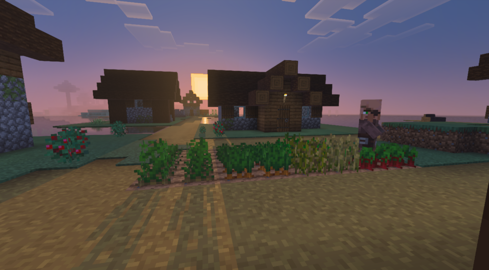

---

## 💡 Dicas e Estratégias

### 🏆 Estratégias de Fazendeiro Pro

<details>
<summary><b>🌟 Estratégia Iniciante: Início Seguro</b></summary>

1. Comece em biomas de **Planície ou Floresta**.
2. Plante **Trigo** primeiro — a planta mais tolerante.
3. Fabrique um **Inspetor de Culturas** imediatamente.
4. Construa perto da água (até 3 blocos da terra arada).
5. Mude para sementes Selecionadas antes de expandir.

</details>

<details>
<summary><b>🌟 Estratégia Intermediária: Diversificação</b></summary>

1. Monte uma **Composteira Melhorada** cedo.
2. Plante culturas diversas para garantir insumos de fertilizante constantes.
3. Combine as plantas com os pontos fortes do seu bioma.
4. Use fertilizante em culturas de alto valor (Melancias, Abóboras).
5. Mantenha um banco de sementes das variedades Selecionadas.

</details>

<details>
<summary><b>🌟 Estratégia Avançada: Exploração de Biomas</b></summary>

1. Estabeleça **fazendas satélite** em biomas ideais:
    - Bioma de Neve → Fazenda de Beterraba
    - Selva → Império de Melancias
    - Pântano → Plantação de Cana-de-Açúcar
2. Use portais do Nether para viagens rápidas entre fazendas.
3. Aplique fertilizante máximo (10) para culturas de caule.
4. Sincronize colheitas com a chuva para irrigação natural.

</details>

### ⚠️ Erros Comuns a Evitar

| Erro                              | Por que é Ruim                      | Solução                                 |
| --------------------------------- | ----------------------------------- | --------------------------------------- |
| Usar apenas sementes Selvagens    | Penalidade de 50% na colheita       | Invista na produção de sementes Selec.  |
| Ignorar o Inspetor de Culturas    | Plantas morrem inesperadamente      | Verifique as condições antes de plantar |
| Plantar melancias em biomas frios | Dano fatal por temperatura          | Combine as plantas com o clima          |
| Regar demais em selvas            | Apodrecimento mata as plantas       | Use solo com hidratação controlada      |
| Negligenciar o fertilizante       | Mais ervas daninhas, menos colheita | Mantenha a Composteira Melhorada ativa  |

---

## Instalação

### Requisitos

- Minecraft Bedrock Edition **1.21.0** ou superior.
- **Recursos Experimentais**: Próximas Funcionalidades de Criador.

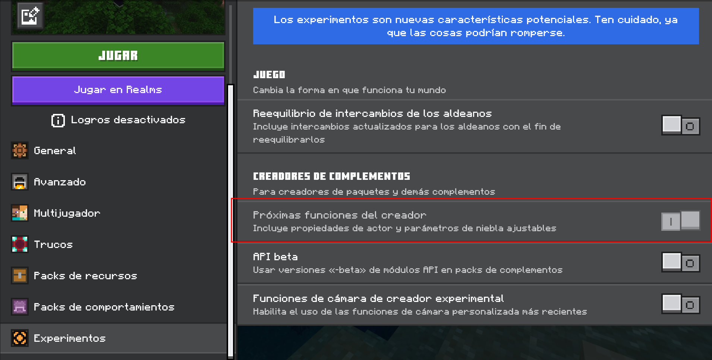

### Passos para Instalação

1. Baixe o arquivo `.mcaddon` de [Curseforge](https://curseforge.com).
2. Clique duas vezes no arquivo para importar para o Minecraft.
3. Crie um novo mundo ou adicione a um mundo existente.
4. Ative o **Behavior Pack** e o **Resource Pack**.
5. Garanta que ambos os pacotes mostrem a versão `0.0.1` ou superior.

### ⚠️ Notas de Compatibilidade

- Este addon **substitui** o comportamento das plantações vanilla.
- Fazendas vanilla existentes continuarão funcionando, mas não terão as novas funções.
- Nova terra arada deve ser criada com uma enxada em blocos de grama/terra.

---

## 🏗️ Construindo a partir do Código Fonte

Para desenvolvedores que desejam contribuir ou customizar:

```bash
# Clonar o repositório
git clone https://github.com/seu-repo/wheel_of_creation.git

# Instalar dependências
npm install

# Modo desenvolvimento (watch)
npm run dev

# Build para produção
npm run build
```

### Estrutura do Projeto

```
wheel_of_creation/
├── Behavior/           # Pack de Comportamento
│   ├── blocks/         # Definições de blocos (JSON)
│   ├── items/          # Definições de itens (JSON)
│   ├── scripts/        # Código fonte TypeScript
│   │   ├── features/   # Mecânicas centrais
│   │   │   ├── blocks/ # Componentes de blocos (Cultura, Solo, etc.)
│   │   │   ├── items/  # Lógica de itens (Inspetor)
│   │   │   └── environment/ # Sistema de clima
│   │   ├── data/       # Persistência de placares
│   │   └── utils/      # Utilidades (Tempo, Cores, etc.)
│   ├── loot_tables/    # Configurações de drop
│   └── recipes/        # Receitas de craft
├── Resource/           # Pack de Recursos
│   ├── models/         # Modelos 3D (geometria)
│   ├── textures/       # Texturas de blocos e itens
│   └── texts/          # Arquivos de tradução
└── scripts/            # Scripts de build
```

---

## 🌐 Localização

O addon está totalmente traduzido para:

- 🇺🇸 Inglês (en_US)
- 🇪🇸 Espanhol (es_ES)
- 🇧🇷 Português - Brasil (pt_BR)

Quer adicionar seu idioma? Verifique `Resource/texts/` para arquivos de referência!

---

## 📜 Créditos

<div align="center">

### Criado com 💚 por **HormigaDev**

---

| Papel                          | Contribuidor                                               |
| ------------------------------ | ---------------------------------------------------------- |
| 🎨 **Criador & Desenvolvedor** | [HormigaDev](https://github.com/HormigaDev)                |
| 💡 **Inspiração**              | [TerraFirmaCraft](https://terrafirmacraft.com/) (Mod Java) |
| 🎮 **Plataforma**              | Minecraft Bedrock Edition                                  |

---

**Wheel of Creation: Agriculture Update** faz parte da série de addons **Wheel of Creation**, trazendo mecânicas realistas e imersivas para o Minecraft Bedrock Edition.

> ⚠️ **Aviso**: Este addon é inspirado no TerraFirmaCraft, mas **NÃO** é um port oficial ou projeto afiliado. Todas as mecânicas, código e artes foram reimaginados e desenvolvidos do zero por HormigaDev para o Minecraft Bedrock Edition.

</div>

---

## 📄 Licença

Este projeto é licenciado sob a **GNU General Public License v3.0 (GPL-3.0)**.

Isso significa que você é livre para:

- ✅ Usar, modificar e distribuir este addon
- ✅ Criar obras derivadas
- ✅ Usar para fins comerciais

Sob as seguintes condições:

- 📋 Obras derivadas também devem ser licenciadas sob GPL-3.0
- 📋 Você deve incluir o aviso de direitos autorais original
- 📋 Você deve disponibilizar seu código fonte

**Contribuições são bem-vindas!** Sinta-se à vontade para enviar pull requests, relatar problemas ou sugerir novas funcionalidades.

Veja o arquivo [LICENSE](LICENSE) para detalhes completos.

---

## 💪 Apoie o Desenvolvimento

<div align="center">

### ❤️ Ajude a Manter Este Projeto Vivo

</div>

Este projeto **é e sempre será open source e gratuito**. Meu objetivo é melhorar o ecossistema do Minecraft Bedrock e dar à comunidade acesso a mecânicas de jogo mais profundas e imersivas.

Porém, quero ser honesto com você: **desenvolver addons dessa complexidade requer centenas de horas**. Os sistemas de biomas, a genética de culturas, os cálculos de crescimento offline, as otimizações de performance, e os testes constantes em diferentes dispositivos—tudo isso requer um investimento de tempo significativo que muitas vezes vem à custa de outras responsabilidades.

Se você curte esse nível de profundidade na sua experiência de Minecraft e quer ver a **Wild Update**, a **Diplomacy Update** e o conteúdo futuro lançado mais rápido, considere apoiar o projeto. Cada contribuição, por menor que seja, me ajuda a dedicar mais tempo ao desenvolvimento ao invés de outros trabalhos.

<div align="center">

### 🌟 Seu Apoio Faz a Diferença

| O Que Seu Apoio Permite                                     |
| ----------------------------------------------------------- |
| ⏰ Mais tempo de desenvolvimento para próximas atualizações |
| 🐛 Correção de bugs e otimizações mais rápidas              |
| 🌍 Mais idiomas e melhor documentação                       |
| 🧪 Testes em mais dispositivos e cenários                   |
| ☕ Café para alimentar as sessões de programação noturnas   |

---

[](https://www.paypal.com/donate/?hosted_button_id=UCL7EE2G44KPQ)

**[Clique aqui para doar via PayPal](https://www.paypal.com/donate/?hosted_button_id=UCL7EE2G44KPQ)**

---

</div>

> 🙏 **Obrigado** a todos que já apoiaram ou contribuíram para este projeto. Seja através de doações, relatórios de bugs, traduções, ou simplesmente espalhando a palavra—vocês são o que faz o open source incrível.

---

## 💬 Junte-se à Comunidade

<div align="center">

[](https://discord.gg/m7cs2EUc8z)

**Quer conversar, compartilhar feedback, ou apenas relaxar?**

Junte-se ao servidor Discord da **BBEL Studios**! Fale diretamente comigo, compartilhe suas fazendas, reporte bugs, sugira ideias, ou simplesmente conecte-se com outros jogadores.

**[👉 Clique aqui para entrar no Discord](https://discord.gg/m7cs2EUc8z)**

</div>

---

<div align="center">

**[⬆ Voltar ao Topo](#-wheel-of-creation-addon)**

---

_Última Atualização: Fevereiro 2026 | Versão 0.0.1 | Agriculture Update I_

**Feito com ❤️ por HormigaDev — Open Source sob GPL-3.0**


</div>
